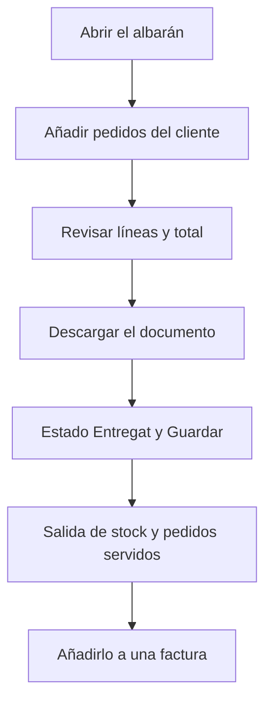

# Albarán de entrega

## Para qué sirve esta pantalla

Es la ficha de un albarán de entrega. En ella añades los pedidos del cliente que se entregan, marcas el albarán como entregado (lo que hace salir el stock del almacén) y descargas su documento. Después, el albarán entregado se añade a una factura: `presupuesto -> pedido -> albarán -> factura`.

## Acciones disponibles

- Guardar la cabecera con «Guardar». Al guardar, vuelves a la pantalla anterior.
- Abrir el menú de la flecha del botón «Guardar» para:
  - «Descargar»: el albarán en Word, con precios.
  - «Imprimir PDF»: el albarán en PDF, con precios.
  - «Descargar sin precio»: el albarán en Word, sin precios.
- Añadir pedidos con el botón «Crear pedido» de la cabecera de las líneas. Se abre el «Selector de pedidos», donde marcas los pedidos y confirmas con el botón de la marca. Con «Buscar» filtras por número de pedido o por número de pedido del cliente.
- Quitar un pedido del albarán con la cruz de la cabecera de su grupo de líneas.
- Entregar el albarán: cambia el «Estado» a «Entregat» y pulsa «Guardar».
- Deshacer la entrega: cambia el «Estado» de «Entregat» a otro estado y pulsa «Guardar».
- Abrir la ficha del cliente con la lupa junto al campo «Cliente».

## Flujo habitual

1. Abre el albarán, normalmente creado desde el pedido con «Crear albarán».
2. Si se entregan más pedidos del mismo cliente, pulsa «Crear pedido», márcalos en el selector y confirma.
3. Revisa las líneas agrupadas por pedido y el total.
4. Descarga el albarán sin precio para acompañar la mercancía, si hace falta.
5. Cuando la mercancía sale, cambia el «Estado» a «Entregat» y pulsa «Guardar».
6. Después, añade el albarán a una factura desde «Facturas de venta».

## Aspectos importantes

- «Número de albarán», «Fecha de creación» y «Número de factura» son de solo lectura. «Número de factura» muestra la factura en la que está el albarán.
- Las líneas no se editan aquí: se copian de las líneas del pedido al añadirlo. Si una línea no es correcta, quita el pedido, corrígelo y vuelve a añadirlo.
- El selector solo muestra pedidos de este cliente que todavía no están en ningún albarán. Un pedido solo puede estar en un albarán.
- Quitar un pedido borra sus líneas del albarán y devuelve el pedido al estado «Comanda», libre para otro albarán.
- El estado solo se puede cambiar hacia «Entregat» o desde «Entregat». Cualquier otro cambio se rechaza. Los nombres de estado aparecen tal como están definidos en el ciclo de vida.
- Al entregar el albarán:
  - Sale del stock la cantidad de cada línea, en la ubicación por defecto, con un movimiento «Albarán» y el número. Las referencias de servicio no mueven stock.
  - Si la referencia trabaja con lotes, se usa el lote de la orden de fabricación que produjo la línea, o se resuelve uno.
  - Los pedidos del albarán pasan a «Comanda Servida».
  - Si la «Fecha de entrega» está vacía, se rellena con la fecha de hoy.
- Al deshacer la entrega, el stock vuelve a entrar con un movimiento «Retorno albarán», los pedidos vuelven a «Comanda» y la «Fecha de entrega» se vacía.
- Un albarán entregado tiene el cliente y la fecha de entrega bloqueados, no admite añadir ni quitar pedidos, y «Guardar» solo se activa si cambias el estado.
- Un albarán facturado queda cerrado: el estado se bloquea y «Guardar» se desactiva, pero las descargas siguen disponibles. Para modificarlo, primero hay que quitarlo de la factura.
- Los movimientos de stock se pueden consultar en «Movimientos de almacén».

## Errores frecuentes

- Si aparece «No se puede editar un albarán entregado», deshaz primero la entrega cambiando el estado y guardando.
- Si aparece «El estado del albarán solo se puede cambiar mediante la acción de entrega», elige «Entregat» o, si ya lo está, otro estado para deshacer la entrega.
- Si aparece «No se puede deshacer la entrega de un albarán facturado», quita primero el albarán de la factura, en «Facturas de venta».
- Si el selector de pedidos aparece vacío, el cliente no tiene pedidos pendientes de albarán: comprueba en «Pedidos» que existan y que no estén ya en otro albarán.
- Si aparece «La orden ya está asignada a otro albarán», quítala primero del otro albarán.
- Si al entregar aparece «No hay una ubicación por defecto definida en el proyecto», avisa al administrador: hay que configurar la ubicación por defecto del almacén.
- Si al deshacer la entrega aparece «El lote ya está cerrado y no se puede reabrir», el lote de la línea se ha cerrado y el stock no puede volver a él.

## Proceso básico

