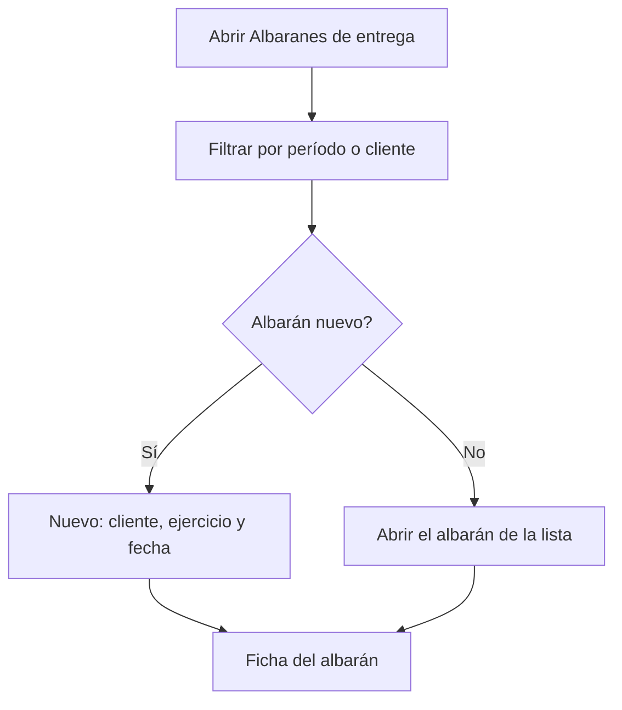

# Albaranes de entrega

## Para qué sirve esta pantalla

Es la lista de los albaranes de entrega a los clientes. En ella buscas los albaranes de un período, los filtras por cliente, abres uno o creas uno nuevo. El albarán es el documento que registra la entrega de los pedidos y el que después se factura: `presupuesto -> pedido -> albarán -> factura`.

## Acciones disponibles

- Filtrar por «Período» y «Cliente», y aplicar el filtro con «Filtrar».
- Restablecer los filtros con «Limpiar»: quita el cliente y devuelve el período al año en curso. Después pulsa «Filtrar» para recargar la lista.
- Crear un albarán vacío con «Nuevo»: se abre el diálogo «Crear albarán», donde eliges el «Cliente», el «Ejercicio» y la «Fecha».
- Abrir un albarán haciendo clic en la fila.
- Eliminar un albarán con el icono de la papelera («Eliminar»), tras confirmarlo.

La tabla muestra el «Número», la «Fecha de creación», la «Fecha de entrega», el «Cliente» y el «Estado».

## Flujo habitual

1. Abre «Albaranes de entrega». Se cargan los albaranes creados durante el año en curso.
2. Ajusta el período o el cliente y pulsa «Filtrar».
3. Abre el albarán que quieres revisar, entregar o descargar.
4. Si tienes que crear un albarán a mano, pulsa «Nuevo», elige el cliente, revisa el ejercicio y la fecha y confirma.
5. En la ficha que se abre, añade los pedidos del cliente que se entregan.

## Aspectos importantes

- El período filtra por la fecha de creación del albarán, no por la fecha de entrega. Sin un período completo la lista no se carga y aparece el aviso «Selecciona un período».
- Esta lista no recuerda los filtros: cada vez que entras vuelve al año en curso sin cliente.
- La forma habitual de crear un albarán es desde la ficha del pedido, con «Crear albarán». Desde aquí se crea vacío y los pedidos se añaden después.
- El número del albarán lo asigna el sistema con el contador del ejercicio elegido, y el albarán nace en el estado inicial de su ciclo de vida («Ciclos de vida»).
- El cliente debe tener la razón social, el NIF, el número de cuenta y al menos una dirección activa, y la sede por defecto de la empresa debe tener los datos de facturación completos.
- La papelera solo aparece en los albaranes que están en el estado inicial y no están facturados. Además, no se puede eliminar un albarán entregado ni uno que aún tenga pedidos: primero hay que quitarlos desde su ficha.
- Eliminar un albarán lo borra definitivamente.

## Errores frecuentes

- Si aparece «Selecciona un período», indica una fecha de inicio y una de fin y vuelve a pulsar «Filtrar».
- Si al eliminar aparece «No se puede eliminar un albarán con pedidos asociados», abre el albarán, quita los pedidos con la cruz de cada grupo y vuelve a intentarlo.
- Si aparece «No se puede eliminar un albarán entregado» o «No se puede eliminar un albarán facturado», el albarán ya forma parte del circuito de entrega o de facturación y no se debe borrar.
- Si al crear el albarán aparece «El cliente no es válido para crear una factura», completa el nombre fiscal, el NIF y el número de cuenta del cliente en «Clientes».
- Si aparece «El cliente no tiene direcciones dadas de alta», añade una dirección al cliente.
- Si no encuentras un albarán, recuerda que el período se compara con la fecha de creación.

## Proceso básico

