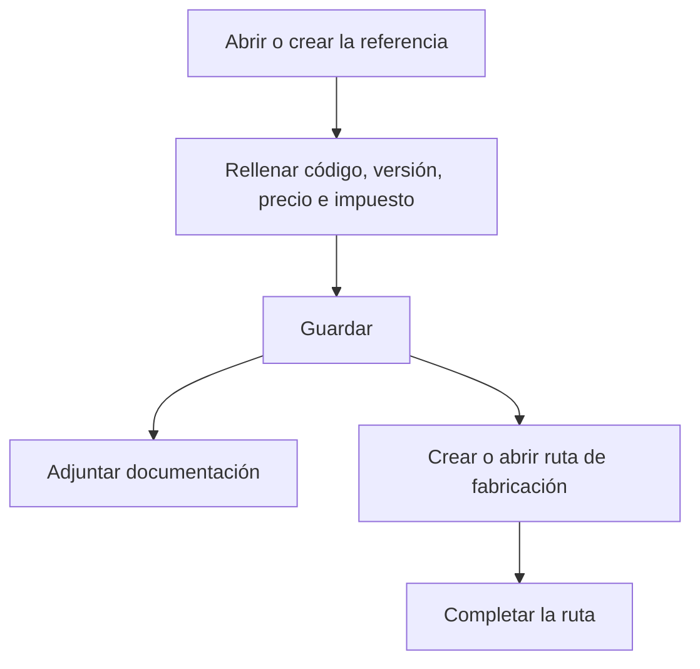

# Referencia

## Para qué sirve esta pantalla

Es la ficha de una referencia de venta. En ella defines el código, la versión, el precio, el impuesto y, si es una pieza exclusiva, el cliente. También adjuntas la documentación técnica y creas las rutas de fabricación que calculan su coste y que después usan los presupuestos y las órdenes de fabricación.

Cuando se entra desde el botón «+» de «Referencias de venta», la pantalla aparece con el título «Alta de referencia».

## Acciones disponibles

- Rellenar los datos de la referencia y guardarlos con «Guardar», en la cabecera.
- Subir, consultar y descargar documentos en la pestaña «Documentación».
- En la pestaña «Rutas de fabricación»:
  - Crear una ruta nueva con el botón «+»: se crea y se abre la ruta para completarla.
  - Abrir una ruta existente haciendo clic en la fila.
  - Eliminar una ruta con la «X», tras confirmarlo.

## Flujo habitual

1. Informa «Código», «Descripción» y «Versión».
2. Elige el «Tipo de material» y, si la pieza es exclusiva de un cliente, el «Cliente».
3. Informa el «Precio unitario» y el «Impuesto»; marca «Servicio» si no es una pieza física.
4. Pulsa «Guardar»: la referencia queda creada y aparece la pestaña «Rutas de fabricación».
5. Adjunta planos o especificaciones en «Documentación».
6. En «Rutas de fabricación», pulsa «+» y completa la ruta en la pantalla que se abre.

## Aspectos importantes

- Campos obligatorios: «Código» (máximo 50 caracteres), «Descripción» (máximo 250), «Versión» (máximo 20), «Precio unitario» e «Impuesto».
- Una referencia nueva empieza con la «Versión» 1.
- «Coste teórico de fabricación» y «Coste de la última fabricación» son de solo lectura. El primero se actualiza al guardar la ruta de fabricación de la referencia; el segundo, con los costes de las órdenes de fabricación.
- El «Precio unitario» es el precio que se propone al añadir la referencia a una línea de presupuesto cuando no hay costes calculados.
- Si informas el «Cliente», la referencia solo se ofrece en las líneas de los presupuestos de ese cliente; sin cliente, se ofrece a todos.
- La pestaña «Rutas de fabricación» solo aparece cuando la referencia ya está guardada. La tabla muestra, para cada ruta, «Cantidad base», «Coste de máquina», «Coste de operario», «Coste de material», «Coste externo» y «Coste total».
- Al guardar una referencia nueva, te quedas en la ficha para continuar con la documentación y las rutas. Al guardar una referencia existente, la pantalla vuelve a la pantalla anterior.
- Una referencia con ruta de fabricación no se puede eliminar desde «Referencias de venta»: primero hay que eliminar sus rutas.

## Errores frecuentes

- Si al crear aparece «La referencia y versión introducidas ya existen», la referencia no se ha podido crear; revisa los datos y vuelve a guardar.
- Si el formulario no se guarda, revisa los mensajes de los campos: «El código es obligatorio», «La versión es obligatoria», «El precio es obligatorio» o «El tipo de IVA es obligatorio».
- Si aparece «Error al crear la ruta de fabricación», vuelve a intentarlo y comprueba que la referencia esté guardada.
- Si aparece «No se ha podido eliminar la ruta», la ruta no se ha eliminado y vuelve a aparecer en la tabla; comprueba si la ruta se usa en presupuestos, pedidos u órdenes de fabricación.

## Proceso básico

