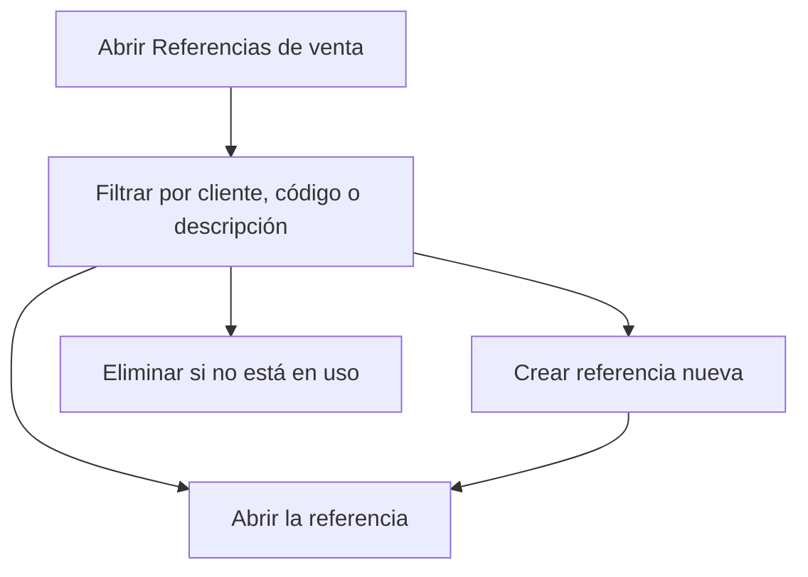

# Referencias de venta

## Para qué sirve esta pantalla

Es el catálogo de referencias que se venden: las piezas o servicios que aparecen en las líneas de presupuestos, pedidos, albaranes y facturas. Desde aquí buscas una, consultas sus adjuntos y creas nuevas. La ficha de cada referencia permite, además, definir sus rutas de fabricación.

## Acciones disponibles

- Filtrar por «Cliente», «Fecha de creación», «Código» y «Descripción»; la lista se filtra mientras cambias los filtros.
- Limpiar todos los filtros con «Limpiar».
- Crear una referencia con el botón «+» («Crear nuevo»): se abre una ficha vacía.
- Abrir una referencia haciendo clic en la fila.
- Consultar los documentos adjuntos de la referencia con el icono del clip («Adjuntos»).
- Eliminar una referencia con el icono de papelera («Eliminar»), tras confirmarlo.
- Adaptar las columnas y guardar vistas con el icono de engranaje («Configuración de la vista»).

## Flujo habitual

1. Abre «Referencias de venta».
2. Filtra por «Cliente» o escribe parte del «Código» o de la «Descripción».
3. Revisa «Versión», «Precio» y «Coste» en la tabla.
4. Haz clic en la fila para abrir su ficha, o pulsa «+» para dar de alta una referencia nueva.
5. Si tienes que revisar planos o documentos, abre los adjuntos con el clip.

## Aspectos importantes

- Solo se muestran las referencias marcadas para ventas. Las referencias de compras y de producción se gestionan desde sus módulos.
- La columna «Coste» muestra el coste teórico de fabricación, calculado a partir de la ruta de fabricación de la referencia.
- Una referencia con «Cliente» informado solo aparece en las líneas de los presupuestos de ese cliente. Las que no tienen cliente aparecen para todos los clientes.
- «Fecha de creación» filtra por la fecha en que se dio de alta la referencia.
- No se puede eliminar una referencia que ya se ha usado: el sistema lo bloquea si tiene pedidos de venta o de compra, albaranes, presupuestos, albaranes de recepción, stock o lotes, movimientos de almacén, una ruta u órdenes de fabricación, si forma parte de una lista de materiales o de una tarifa de compra, o si es el servicio externo de una fase. Cuando se puede eliminar, la eliminación es definitiva.

## Errores frecuentes

- Si al eliminar aparece «Referencia con dependencias:» seguido de una lista, la referencia está en uso. Cada línea indica el motivo; por ejemplo, «Tiene una ruta de producción definida» significa que primero hay que eliminar la ruta desde la ficha de la referencia.
- Si no encuentras una referencia, pulsa «Limpiar»: puede quedar aplicado un filtro de cliente o de fecha.
- Si la referencia existe pero no aparece aquí, puede que no esté marcada para ventas.

## Proceso básico

