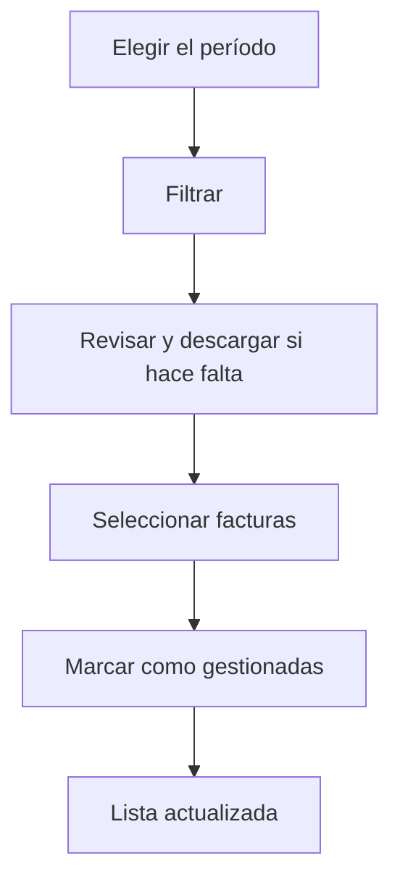

# Contabilización de facturas de venta

## Para qué sirve esta pantalla

Sirve para cerrar administrativamente las facturas de venta de un período: las listas, las revisas y marcas muchas a la vez como gestionadas, por ejemplo cuando ya se han pasado a la contabilidad. No sustituye a «Facturas de venta»: aquí no se crean ni se editan facturas.

## Acciones disponibles

- Elegir el «Período» en el calendario (fecha de inicio y de fin) y pulsar «Filtrar».
- Marcar «Gestionadas» para incluir también las facturas que ya están gestionadas.
- Restablecer con «Limpiar»: vacía el período, desmarca «Gestionadas» y vacía la lista.
- Seleccionar facturas con las casillas de la primera columna.
- Marcar las facturas seleccionadas como gestionadas con el botón verde de la marca («Marcar como gestionadas»).
- Descargar una factura en Word con el icono de descarga de su fila («Descargar factura»).

La tabla muestra el «Número», el «Cliente», el «Estado», la «Fecha», el «Vencimiento» (el último vencimiento) y el «Importe base».

## Flujo habitual

1. Abre «Contabilización de facturas de venta». La lista aparece vacía.
2. Elige el período, por ejemplo el mes que quieres cerrar, y pulsa «Filtrar».
3. Revisa las facturas pendientes y, si hace falta, descarga alguna para comprobarla.
4. Selecciona las facturas que ya has tratado.
5. Pulsa el botón «Marcar como gestionadas». Aparece el mensaje «Facturas contabilizadas» con el número de facturas y la lista se recarga.

## Aspectos importantes

- El período filtra por la fecha de la factura y no tiene valor por defecto: sin período la lista no se carga y aparece el aviso «Selecciona un período».
- Por defecto solo aparecen las facturas que todavía no están en el estado «Gestionada». Al marcar o desmarcar «Gestionadas» la lista se recarga sola.
- El botón de marcar solo se activa cuando hay al menos una factura seleccionada.
- La acción pone directamente el estado «Gestionada» a todas las facturas seleccionadas, sea cual sea su estado actual y sin pasar por las transiciones del ciclo de vida.
- Depende de que el ciclo de vida de las facturas de venta tenga un estado llamado exactamente «Gestionada» («Ciclos de vida»). Si no existe, el botón no hace nada.
- Para abrir o modificar una factura, usa «Facturas de venta».

## Errores frecuentes

- Si aparece «Selecciona un período», elige una fecha de inicio y una de fin y vuelve a pulsar «Filtrar».
- Si no aparece ninguna factura de un período ya cerrado, marca «Gestionadas»: probablemente ya están todas gestionadas.
- Si el botón de marcar está desactivado, selecciona al menos una factura.
- Si al pulsar el botón no pasa nada, comprueba en «Ciclos de vida» que exista el estado «Gestionada».
- Si aparece «Error al descargar la factura», vuelve a intentarlo y, si persiste, abre la factura desde «Facturas de venta» y descárgala desde su ficha.

## Proceso básico

