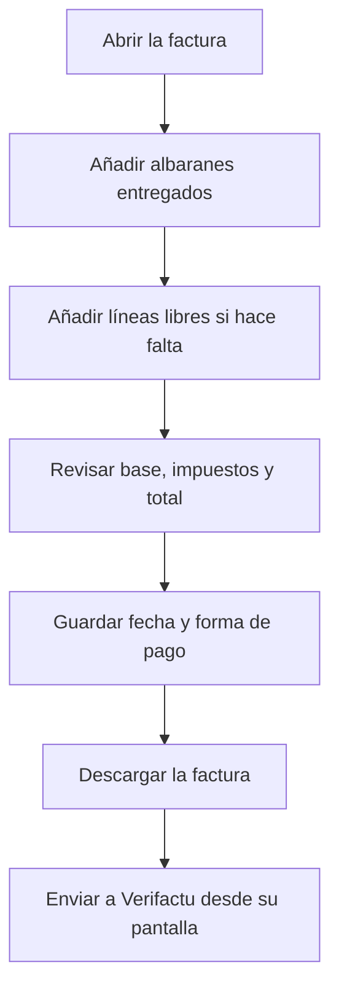

# Factura de venta

## Para qué sirve esta pantalla

Es la ficha de una factura de venta. En ella añades los albaranes entregados del cliente o líneas libres, revisas la base, los impuestos y el total, descargas su documento y, si hace falta, creas una factura rectificativa. Es el último paso del circuito `presupuesto -> pedido -> albarán -> factura`; el envío a Verifactu se hace después, desde otra pantalla.

## Acciones disponibles

- Guardar la cabecera con «Guardar»: «Fecha de factura», «Estado» y «Método de pago». Al guardar, vuelves a la pantalla anterior.
- Abrir el menú de la flecha del botón «Guardar» para:
  - «Descargar»: la factura en Word.
  - «Imprimir PDF»: la factura en PDF.
  - «Factura rectificativa»: abre el diálogo «Crear factura rectificativa».
- Consultar los totales en las tarjetas «Base imponible», «Impuestos» y «Total factura», y el estado de envío en la tarjeta «Verifactu».
- Pestaña «Detalles de la factura»:
  - Añadir albaranes con el botón «Crear albarán»: se abre el «Selector de albaranes de entrega» con los albaranes del cliente pendientes de facturar.
  - Añadir una línea libre con «Añadir línea»: «Descripción», «Impuesto», «Cantidad» y «Precio unitario»; el «Total» se calcula solo.
  - Eliminar una línea libre con la cruz de la línea.
  - Quitar un albarán entero de la factura con la cruz de la cabecera de su grupo.
- Pestaña «Datos fiscales»: corregir los datos fiscales del cliente en esta factura y guardarlos con «Guardar datos fiscales».

## Flujo habitual

1. Crea la factura desde «Facturas de venta» y se abre esta ficha.
2. Pulsa «Crear albarán», marca los albaranes entregados que quieres facturar y confirma.
3. Si hay que facturar algún concepto que no viene de un albarán, añádelo con «Añadir línea».
4. Revisa la «Base imponible», los «Impuestos» y el «Total factura».
5. Comprueba la «Fecha de factura» y el «Método de pago» y pulsa «Guardar».
6. Descarga la factura en PDF o Word para enviarla al cliente.

## Aspectos importantes

- Las líneas se agrupan por albarán. Las líneas de un albarán no se eliminan una a una: se quita el albarán entero. Ninguna línea se edita: para cambiar una línea libre, elimínala y vuelve a crearla.
- Solo se pueden añadir albaranes del mismo cliente, en estado «Entregat», con líneas y que no estén en otra factura. Cada línea toma el impuesto de su referencia o, si no tiene, el IVA del 21 %.
- Al añadir un albarán, sus pedidos pasan a «Comanda Facturada» y el albarán queda bloqueado. Al quitarlo, el albarán vuelve a quedar libre para facturar y los pedidos vuelven a «Comanda Servida». Los nombres de estado aparecen tal como están definidos en el ciclo de vida.
- La base, los impuestos y el total se recalculan solos, agrupados por impuesto, cada vez que añades o quitas líneas o albaranes.
- Los vencimientos se generan solos a partir de la forma de pago y de la fecha de la factura: el total se reparte entre el número de pagos de la forma de pago. Se recalculan al guardar la cabecera y al cambiar las líneas. Las formas de pago se configuran en «Formas de pago».
- El desplegable «Estado» solo ofrece los estados a los que se puede pasar desde el actual, según «Ciclos de vida».
- «Crear factura rectificativa» siempre crea una factura nueva, con número nuevo y fecha de hoy, que copia todas las líneas de la original en negativo. Si marcas «Crear factura con importe corregido», también crea una segunda con una sola línea por el valor de «Importe a facturar sin IVA», que no puede superar la base de la original. La factura original no cambia.
- Las facturas rectificativas no se pueden modificar: los botones del detalle quedan desactivados y el menú no ofrece «Factura rectificativa».
- La tarjeta «Verifactu» muestra el estado de envío de la factura. El envío no se hace desde aquí, sino desde «Integración de Facturas en Verifactu».
- La pestaña «Datos fiscales» solo aparece mientras el estado Verifactu es «Pendent» o «Error». Al guardar, los datos también se actualizan en la ficha del cliente. Si el cliente tiene otras facturas pendientes o con error, el sistema pregunta si también se deben aplicar: «Sí, propagar» las actualiza todas y «Cancelar» no guarda nada.

## Errores frecuentes

- Si «Guardar» no guarda, revisa los avisos «La fecha de factura es obligatoria» y «El método de pago es obligatorio».
- Si el selector de albaranes aparece vacío, comprueba en «Albaranes de entrega» que los albaranes del cliente estén en estado «Entregat» y que no estén ya en otra factura.
- Si aparece «No se puede facturar un albarán sin líneas», añade pedidos al albarán antes de facturarlo.
- Si aparece «No existe el impuesto IVA 21%», hay que dar de alta un impuesto del 21 % en «Impuestos».
- Si los botones del detalle aparecen desactivados, la factura es una rectificativa y no se puede modificar.
- Si al crear la rectificativa aparece «La cantidad introducida no puede ser superior a la cantidad de la factura», el importe corregido debe ser igual o inferior a la base imponible de la factura original.
- Si al guardar los datos fiscales aparece «CIF/NIF inválido», revisa el «NIF/CIF».
- Si no ves la pestaña «Datos fiscales», el estado Verifactu de la factura ya no es «Pendent» ni «Error», normalmente porque ya se ha enviado correctamente, y sus datos fiscales ya no se pueden cambiar.

## Proceso básico

