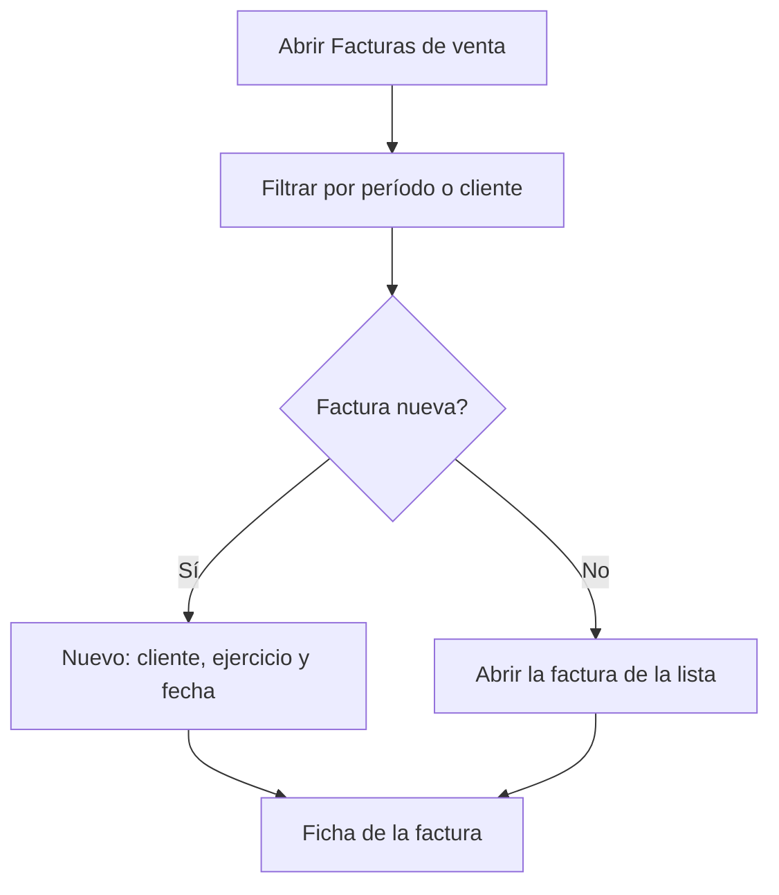

# Facturas de venta

## Para qué sirve esta pantalla

Es la lista de las facturas de venta. En ella buscas las facturas de un período, las filtras por cliente, abres una o creas una nueva. La factura es el último documento del circuito de venta: `presupuesto -> pedido -> albarán -> factura`. Para marcar muchas facturas como gestionadas a la vez, usa «Contabilización de facturas de venta».

## Acciones disponibles

- Filtrar por «Período» y «Cliente», y aplicar el filtro con «Filtrar».
- Restablecer los filtros con «Limpiar»: quita el cliente y devuelve el período al año en curso. Después pulsa «Filtrar» para recargar la lista.
- Crear una factura con «Nuevo»: se abre el diálogo «Crear factura», donde eliges el «Cliente», el «Ejercicio» y la «Fecha».
- Abrir una factura haciendo clic en la fila.
- Eliminar una factura con el icono de la papelera («Eliminar»), tras confirmarlo.

La tabla muestra el «Número», la «Fecha», el «Cliente», el «Estado», el «Vencimiento» (el último vencimiento de la factura) y el «Importe» total.

## Flujo habitual

1. Abre «Facturas de venta». Se cargan las facturas del año en curso, o los últimos filtros que usaste.
2. Ajusta el período o el cliente y pulsa «Filtrar».
3. Para facturar entregas, pulsa «Nuevo», elige el cliente, revisa el ejercicio y la fecha de factura y confirma.
4. Al crearla se abre la ficha de la factura, donde añades los albaranes entregados o líneas libres.
5. Para revisar o descargar una factura existente, haz clic en su fila.

## Aspectos importantes

- El período filtra por la fecha de la factura. La pantalla recuerda el período y el cliente cuando sales de ella.
- La «Fecha» del diálogo es la fecha de la factura. El ejercicio propuesto es el que tiene como nombre el año en curso, y el número de factura lo asigna el sistema con el contador de ese ejercicio.
- Al crear la factura se copian los datos fiscales del cliente (nombre, NIF, número de cuenta y dirección principal) y su forma de pago. Los cambios posteriores en la ficha del cliente no modifican la factura.
- La factura nueva nace en el estado inicial de su ciclo de vida («Ciclos de vida») y con el estado Verifactu inicial, pendiente de enviar.
- El cliente debe tener informados la razón social, el NIF y el número de cuenta y al menos una dirección activa, y la sede por defecto de la empresa debe tener los datos de facturación completos.
- La papelera solo aparece en las facturas que están en el estado inicial del ciclo de vida. Eliminar una factura la borra definitivamente y libera sus albaranes, que se pueden volver a facturar.

## Errores frecuentes

- Si no aparece ninguna factura, comprueba que el período tenga fecha de inicio y de fin y que el filtro de cliente sea el correcto.
- Si al crear la factura aparece «El cliente no es válido para crear una factura», completa el nombre fiscal, el NIF y el número de cuenta del cliente en «Clientes».
- Si aparece «El cliente no tiene direcciones dadas de alta», añade una dirección al cliente.
- Si la creación falla con un error del servidor, comprueba que el cliente tenga una forma de pago asignada.
- Si aparece que la sede no es válida, revisa los datos de facturación de la sede por defecto de la empresa.
- Si no ves la papelera en una factura, es que ya no está en el estado inicial.

## Proceso básico

