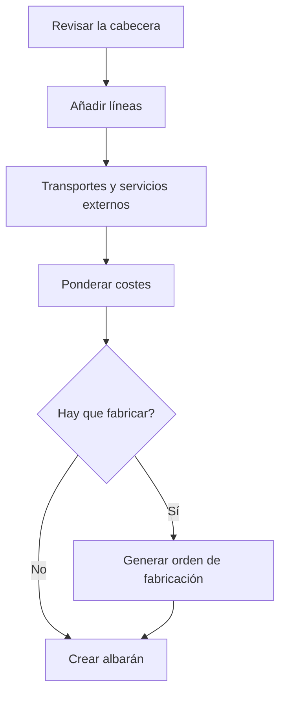

# Pedido

## Para qué sirve esta pantalla

Es la ficha de un pedido de venta. En ella mantienes la cabecera, las líneas con sus costes y precios, los transportes, los servicios externos y los archivos adjuntos. Desde aquí también generas las órdenes de fabricación de cada línea y creas el albarán del pedido, dentro del circuito `presupuesto -> pedido -> albarán -> factura`.

## Acciones disponibles

- Guardar la cabecera con «Guardar». Al guardar, vuelves a la pantalla anterior.
- Abrir el menú de la flecha del botón «Guardar» para:
  - «Descargar»: el pedido en Word, con precios.
  - «Imprimir PDF»: el pedido en PDF, con precios.
  - «Descargar sin precio»: el pedido en Word, sin precios.
  - «Crear albarán»: crea el albarán de entrega con todas las líneas del pedido y lo abre.
- Cambiar el «Estado» del pedido con el desplegable.
- Abrir la ficha del cliente con la lupa junto al campo «Cliente».
- Pestaña «Detalle»: añadir líneas con «Añadir línea», editar una línea haciendo clic en ella, eliminarla con la cruz y repartir costes con «Ponderar costes».
- En la columna «Orden de fabricación» de cada línea: generar su orden de fabricación con el botón «+», o abrir la orden ya generada con el botón que muestra su código.
- Pestaña «Transportes»: añadirlos con «Añadir transporte» y editarlos haciendo clic en ellos.
- Pestaña «Servicios externos»: elegir el «Proveedor» de cada servicio externo.
- Pestaña «Archivos»: subir, previsualizar, descargar y eliminar documentos del pedido.

## Flujo habitual

1. Revisa la cabecera: «Cliente», «Pedido del cliente», «Fecha de alta» y «Fecha de entrega».
2. En «Detalle», pulsa «Añadir línea», elige la «Referencia» y, si la tiene, la «Ruta de fabricación»; ajusta la «Cantidad», los márgenes y el «Descuento» y guarda la línea.
3. Si hace falta, añade los transportes y elige el proveedor de los servicios externos; después pulsa «Ponderar costes».
4. Para cada línea que se deba fabricar, pulsa «+» en «Orden de fabricación», revisa la ruta, la cantidad y la «Fecha prevista» y genera la orden.
5. Cuando el pedido esté listo para entregar, elige «Crear albarán» en el menú de «Guardar».
6. Descarga el documento con o sin precios si lo tienes que enviar al cliente.

## Aspectos importantes

- «Núm. de pedido», «Núm. de presupuesto» y «Albarán de entrega» son de solo lectura. Los dos últimos muestran el presupuesto de origen y el albarán en el que está el pedido.
- El desplegable «Estado» solo ofrece los estados a los que se puede pasar desde el actual, según el ciclo de vida configurado en «Ciclos de vida».
- Además, el sistema cambia el estado del pedido por sí solo: pasa a «Comanda Servida» cuando su albarán se entrega, a «Comanda Facturada» cuando el albarán se añade a una factura, y vuelve a «Comanda» si se quita del albarán. Estos nombres de estado aparecen tal como están definidos en el ciclo de vida.
- Cuando el pedido ya está en un albarán, las líneas quedan bloqueadas: desaparecen «Añadir línea», «Ponderar costes» y «Añadir transporte», las líneas no se abren ni se eliminan y el botón «+» para generar órdenes queda desactivado.
- Una línea con orden de fabricación o ya entregada no se puede eliminar: la cruz no aparece.
- En el diálogo de la línea, la «Referencia» solo muestra las referencias de este cliente y las que no son de ningún cliente. Al elegirla se rellenan la descripción, el precio y el coste; si la referencia tiene una sola ruta de fabricación activa, se elige sola y los costes salen de la ruta. La pestaña «Márgenes» permite ajustar el beneficio por fase.
- «Ponderar costes» reparte el precio de los transportes entre las líneas según el peso y el de los servicios externos según la tarifa de compra del proveedor, y después recalcula el «Precio unitario» y el total de cada línea a partir del coste, el beneficio y el descuento. Los precios que habías modificado a mano se sobrescriben.
- Los servicios externos los calcula el sistema a partir de las fases externas de las rutas de las líneas. Al elegir el proveedor, el precio se calcula con su tarifa y se guarda sin pulsar «Guardar».
- En las líneas, «Coste unitario teórico» y «Coste teórico» salen de la ruta de fabricación, y «Coste unitario real» y «Coste real» de la orden de fabricación ya ejecutada.
- El pedido no mueve stock. El stock sale del almacén cuando el albarán pasa al estado «Entregat».
- «Crear albarán» crea el albarán con la fecha de hoy, en el ejercicio de la fecha actual y en el estado inicial. Un pedido solo puede estar en un albarán.

## Errores frecuentes

- Si al guardar aparece «La fecha no puede estar vacía», informa la «Fecha de alta».
- Si «Crear albarán» avisa «Este documento ya tiene un documento asociado», el pedido ya está en un albarán: búscalo en «Albaranes de entrega» por el número que aparece en «Albarán de entrega».
- Si «Crear albarán» falla con «No se ha encontrado ningún ejercicio para la fecha actual», hay que dar de alta el ejercicio del año en curso en «Ejercicios».
- Si no puedes editar ni eliminar líneas, comprueba si el pedido ya tiene albarán. Mientras el albarán no esté entregado ni facturado, puedes quitar el pedido desde la ficha del albarán.
- Si al generar la orden de fabricación aparece «La ruta de fabricación es obligatoria», la referencia no tiene ninguna ruta activa: créala o actívala antes.
- Si aparece «No se han podido ponderar los costes.», comprueba que el pedido tenga líneas.

## Proceso básico

