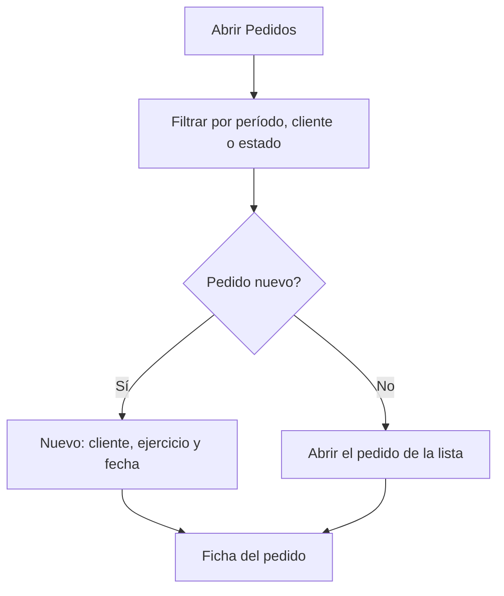

# Pedidos

## Para qué sirve esta pantalla

Es la lista de los pedidos de venta. En ella buscas los pedidos de un período, los filtras por cliente o por estado, abres uno o creas uno nuevo. El pedido es el segundo paso del circuito de venta: `presupuesto -> pedido -> albarán -> factura`. También se puede crear un pedido a partir de un presupuesto, desde la pantalla «Presupuestos» con «Crear pedido».

## Acciones disponibles

- Filtrar por «Período», «Cliente» y «Estado», y aplicar el filtro con «Filtrar».
- Restablecer los filtros con «Limpiar»: quita el cliente y el estado, devuelve el período al año en curso y recarga la lista.
- Crear un pedido con «Nuevo»: se abre el diálogo «Crear pedido», donde eliges el «Cliente», el «Ejercicio» y la «Fecha».
- Abrir un pedido haciendo clic en la fila.
- Consultar los archivos adjuntos de un pedido con el icono del clip («Adjuntos»), sin salir de la lista.
- Eliminar un pedido con el icono de la papelera («Eliminar»), tras confirmarlo.

La tabla muestra el «Número», la «Fecha», la «Fecha de entrega», el «Cliente», el «Pedido del cliente» (la referencia de pedido del cliente) y el «Estado».

## Flujo habitual

1. Abre «Pedidos». Se cargan los pedidos del año en curso, o los últimos filtros que usaste.
2. Ajusta el período, el cliente o el estado y pulsa «Filtrar».
3. Para un pedido nuevo, pulsa «Nuevo», elige el cliente, revisa el ejercicio y la fecha y confirma.
4. Al crearlo se abre directamente la ficha del pedido, donde añades las líneas.
5. Para revisar o continuar un pedido existente, haz clic en su fila.

## Aspectos importantes

- El período filtra por la fecha del pedido. Si no hay un período completo (fecha de inicio y de fin), la lista no se carga y aparece el aviso «Selecciona un período».
- La pantalla recuerda el período, el cliente y el estado cuando sales de ella y los recupera al volver.
- El ejercicio propuesto es el que tiene como nombre el año en curso. El número del pedido lo asigna el sistema con el contador de ese ejercicio.
- El pedido nuevo nace en el estado inicial del ciclo de vida de los pedidos, que se configura en «Ciclos de vida».
- El cliente debe tener informados la razón social, el NIF y el número de cuenta, y al menos una dirección activa. La sede por defecto de la empresa también debe tener completos los datos de facturación (dirección, población, código postal, provincia, país y NIF).
- La papelera solo aparece en los pedidos que están en el estado inicial del ciclo de vida.
- Eliminar un pedido lo borra definitivamente. Si el pedido venía de un presupuesto, el presupuesto vuelve a su estado inicial y pierde la fecha de aceptación, de modo que se puede volver a convertir en pedido.

## Errores frecuentes

- Si aparece «Selecciona un período», indica una fecha de inicio y una de fin y vuelve a pulsar «Filtrar».
- Si al crear el pedido aparece «El cliente no es válido para crear una factura», completa el nombre fiscal, el NIF y el número de cuenta en la ficha del cliente, en «Clientes».
- Si aparece «El cliente no tiene direcciones dadas de alta», añade una dirección al cliente.
- Si aparece que la sede no es válida, revisa los datos de facturación de la sede por defecto de la empresa.
- Si no ves la papelera en un pedido, es que ya no está en el estado inicial: cambia su estado desde la ficha si hace falta.

## Proceso básico

