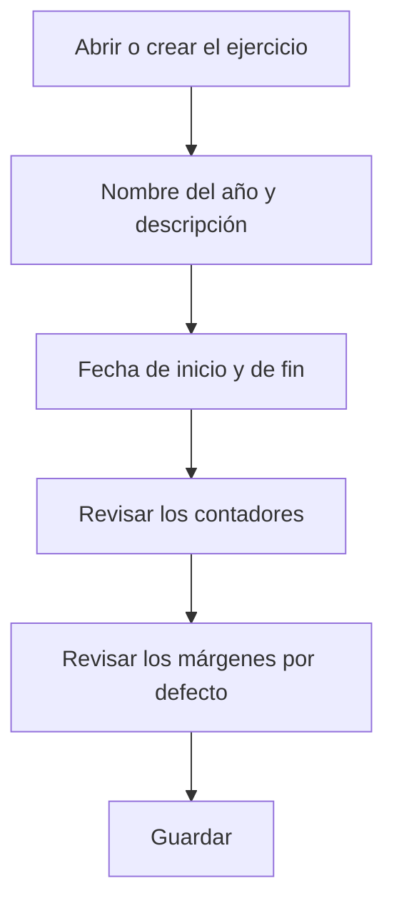

# Ejercicio

## Para qué sirve esta pantalla

Es la ficha de un ejercicio. En ella defines el periodo de fechas, los contadores con los que se numeran los documentos del ejercicio y los márgenes por defecto de las líneas nuevas. Todos los documentos de venta y de compra que se numeran en este ejercicio toman el número de aquí: presupuesto, pedido, albarán y factura, y también pedido, albarán y factura de compra.

## Acciones disponibles

- Rellenar «Nombre», «Descripción», «Fecha inicio» y «Fecha fin».
- Ajustar los contadores: «Presupuestos», «Pedidos de venta», «Albaranes de venta», «Facturas de venta», «Pedidos de compra», «Albaranes de recepción» y «Facturas de compra».
- Definir «Margen material por defecto (%)» y «Margen externo por defecto (%)».
- Marcar «Desactivado» cuando el ejercicio ya no se tenga que usar.
- Guardar con «Guardar», en la cabecera. Al guardar, vuelves a la pantalla anterior.

## Flujo habitual

1. Desde «Ejercicios», pulsa «+» o abre el ejercicio que quieres revisar.
2. Escribe como nombre el año, por ejemplo «2027», y una descripción.
3. Indica la fecha de inicio y la de fin del ejercicio.
4. En un ejercicio nuevo, deja los contadores vacíos o a 0 para que la numeración empiece por 1.
5. Revisa los márgenes por defecto.
6. Pulsa «Guardar».

## Aspectos importantes

- «Nombre», «Descripción», «Fecha inicio» y «Fecha fin» son obligatorios, y la fecha de fin debe ser posterior a la de inicio. No puede haber dos ejercicios con el mismo nombre.
- Cada contador guarda el último número utilizado de ese tipo de documento, con tres cifras. El número del documento siguiente son las dos últimas cifras del nombre del ejercicio seguidas del contador más uno. Por ejemplo, en el ejercicio «2026», con «Facturas de venta» en 041, la factura siguiente será la 26042 y el contador pasará a 042.
- Por eso el nombre debe terminar en dos cifras (el año) y los contadores solo pueden contener cifras.
- El contador tiene tres cifras: a partir del documento 999 de un tipo dentro del ejercicio, la numeración deja de ser correcta.
- Si modificas un contador, cambias el número del documento siguiente. No lo bajes por debajo del último número emitido: al guardar el ejercicio no se comprueba y podrían repetirse números.
- Las órdenes de fabricación también se numeran con un contador del ejercicio, que no se muestra en este formulario.
- Al crear un documento a mano, se elige el «Ejercicio» en el diálogo de creación (se propone el que se llama como el año en curso). Cuando el documento se genera automáticamente, se usa el ejercicio que incluye la fecha: la de hoy para pedidos desde presupuesto y albaranes desde pedido, la fecha planificada para las órdenes de fabricación y la fecha de la factura para las facturas de compra.
- Los márgenes por defecto se proponen en las líneas nuevas de los presupuestos y de los pedidos de venta de este ejercicio. El margen externo también se propone cuando una fase de una ruta de fabricación se marca como trabajo externo, con el ejercicio vigente hoy. Un ejercicio nuevo empieza con un 30 % en ambos.
- Si dejas un margen a 0, las líneas nuevas proponen igualmente un 30 %.
- Un ejercicio desactivado no sirve para crear facturas de compra.

## Errores frecuentes

- Si al guardar aparece «La fecha final del ejercicio debe ser posterior al inicio», revisa «Fecha inicio» y «Fecha fin».
- Si al guardar un ejercicio nuevo aparece un error, comprueba que no haya otro con el mismo nombre.
- Si al crear un documento aparece «Error al crear el contador» o un error inesperado, revisa que el nombre del ejercicio termine en dos cifras y que el contador de ese documento solo tenga cifras.
- Si aparece «No se ha encontrado ningún ejercicio para la fecha actual», revisa las fechas del ejercicio: la fecha del documento debe quedar entre el inicio y el fin.

## Proceso básico

