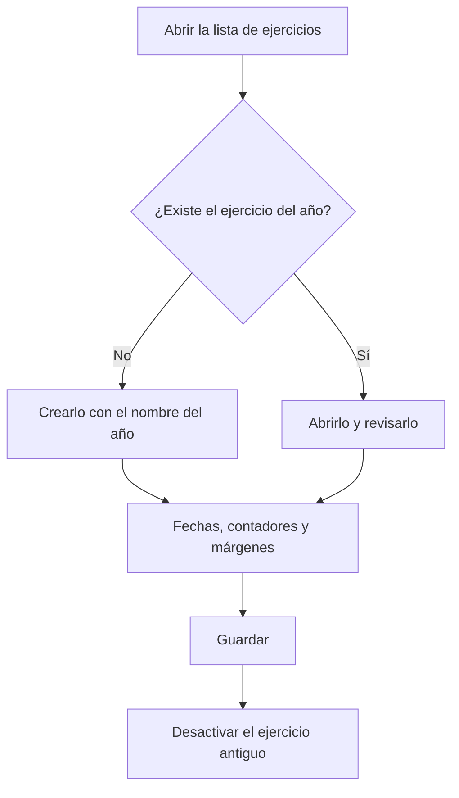

# Ejercicios

## Para qué sirve esta pantalla

Lista los ejercicios, los periodos de fechas (normalmente un año) con los que la empresa numera los documentos. Cada ejercicio tiene sus contadores de presupuestos, pedidos, albaranes y facturas, y los márgenes por defecto que se proponen en las líneas nuevas. Debe existir un ejercicio que cubra las fechas en que se crean los documentos; si no, el programa no puede numerarlos.

## Acciones disponibles

- Consultar el nombre, la descripción, la «Fecha inicio», el «Día de fin» y si el ejercicio está «Desactivado».
- Crear un ejercicio nuevo con el botón verde «+» («Crear nuevo»).
- Abrir un ejercicio haciendo clic en su fila para revisar sus contadores o sus fechas.

## Flujo habitual

1. Antes de que empiece el año, abre la lista de ejercicios.
2. Pulsa «+» para crear el ejercicio nuevo.
3. Ponle como nombre el año, por ejemplo «2027», y las fechas de inicio y de fin del año.
4. Revisa los contadores y los márgenes por defecto y guárdalo.
5. Cuando el ejercicio anterior ya no se tenga que usar, ábrelo y márcalo como «Desactivado».

## Aspectos importantes

- Pon como nombre del ejercicio el año con cuatro cifras. Los números de los documentos empiezan con las dos últimas cifras del nombre, y varias pantallas proponen por defecto el ejercicio que se llama como el año en curso.
- Crea el ejercicio del año siguiente antes de que empiece. Cuando el programa genera un documento automáticamente (un pedido desde un presupuesto, un albarán desde un pedido o una orden de fabricación), busca el ejercicio que incluye la fecha; si no hay ninguno, no lo crea.
- Evita que dos ejercicios tengan fechas que se solapen: cuando el programa busca el ejercicio de una fecha, solo toma uno.
- Esta pantalla no permite eliminar ejercicios. Para dejar de usar uno, márcalo como «Desactivado».
- No se puede crear una factura de compra si el ejercicio que incluye la fecha de la factura está desactivado.
- Los contadores y los márgenes se explican en la ayuda de la ficha «Ejercicio».

## Errores frecuentes

- Si al crear un documento aparece «No se ha encontrado ningún ejercicio para la fecha actual», crea el ejercicio que incluye la fecha de hoy o revisa las fechas del existente.
- Si al crear una factura de compra aparece «Ejercicio inválido», comprueba que haya un ejercicio que incluya la fecha de la factura y que no esté «Desactivado».
- Si al crear un documento no se te propone ningún ejercicio, comprueba que haya uno que se llame como el año en curso.

## Proceso básico

