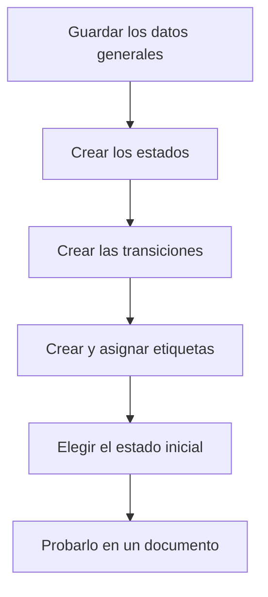

# Ciclo de vida

## Para qué sirve esta pantalla

Configura un ciclo de vida: los estados por los que pasa un tipo de documento, las transiciones que permiten pasar de un estado a otro y las etiquetas que dan un significado especial a algunos estados. Las transiciones deciden qué estados aparecen en el desplegable de estado de cada documento, y las etiquetas deciden, por ejemplo, qué órdenes de fabricación (OF) se pueden planificar o cargar en planta. Es una pantalla de configuración para el administrador.

## Acciones disponibles

- Editar el «Nombre», la «Descripción» y el «Estado inicial» del ciclo de vida, y guardarlos con «Guardar».
- En la pestaña «Estados y Transiciones», añadir un estado con el botón «+» de la tabla «Estados», o abrirlo haciendo clic en la fila para cambiar su «Nombre», el «Color», la casilla «Deshabilitado» y las «Etiquetas».
- Eliminar un estado con la «X» de la fila. La «X» solo aparece si el estado no forma parte de ninguna transición.
- En la misma pestaña, añadir una transición con el botón «+» de la tabla «Transiciones», indicando el «Nombre», el «Origen» y el «Destino». Haz clic en la fila para editarla o en la «X» para eliminarla.
- En la pestaña «Etiquetas», crear etiquetas con el botón «+» (con «Nombre», «Descripción», «Color» e «Icono»), editarlas con el lápiz o eliminarlas con la papelera.

## Flujo habitual

1. Abre el ciclo de vida desde «Gestión de ciclos de vida».
2. En «Estados y Transiciones», crea los estados que faltan y elige el «Color» de cada uno.
3. Crea las transiciones: una para cada paso permitido, del estado de «Origen» al de «Destino».
4. Si el ciclo de vida lo necesita, crea las etiquetas en «Etiquetas» y asígnalas a los estados desde el diálogo de cada estado.
5. Elige el «Estado inicial» y guarda con «Guardar».
6. Abre un documento de este tipo y comprueba que el desplegable de estado ofrece los cambios esperados.

## Aspectos importantes

- **Los nombres de los estados forman parte del funcionamiento.** Muchos procesos automáticos buscan el estado por su nombre exacto, tal como está escrito (los nombres son los originales en catalán). Por ejemplo, «Acceptat» y «Rebutjat» en los presupuestos; «Comanda», «Comanda Servida» y «Comanda Facturada» en los pedidos; «Entregat» en los albaranes; «Cobrada» en las facturas; «Recepcionat» en las recepciones; «Rebuda», «Rebuda parcialment», «Pendent de rebre» y «Cancel·lada» en las compras; y «Creada», «Llançada», «Producció», «Pausa», «Tancada», «Servei Extern» y «Cancel·lada» en las OF. No los renombres: estos automatismos (movimientos de almacén, cambios de estado en cadena, cierre de fases, cuadros de mando) dejarían de funcionar o darían «El estado con ID ... no existe o está deshabilitado».
- **El nombre del ciclo de vida tampoco se debe cambiar**: el programa lo busca por su nombre interno.
- **Transiciones**: en el desplegable de estado de un documento solo aparecen los estados de destino de las transiciones que salen del estado actual. Si falta una transición, el usuario no podrá hacer ese cambio. En planta, al cerrar o pausar una fase, el programa busca una transición del estado actual hacia «Tancada» o «Pausa».
- **«Deshabilitado»**: un estado deshabilitado deja de aparecer como destino en los desplegables de estado. Los documentos que ya están en él no cambian. Para retirar un estado, deshabilítalo en lugar de eliminarlo.
- **«Estado inicial»**: es el estado que reciben los documentos nuevos. Si no lo hay, la creación de esos documentos falla. En el ciclo de vida de las OF, además, las OF en el estado inicial pasan a «Llançada» cuando se priorizan.
- **«Color»**: es el color con el que el estado aparece en las listas de documentos. Elígelo por su significado: «En curso», «Requiere acción», «Hecho», «Problema», «Cerrado», «Neutro» o «Sin color».
- **Etiquetas con significado especial** en el ciclo de vida de las OF: las OF en estados con la etiqueta `Available` son las que se pueden planificar y cuentan para la carga de las máquinas (si ningún estado la tiene, solo se planifican las OF en el estado inicial); `Plant` hace que las fases de la OF aparezcan en las máquinas de planta para cargarlas; `ExternalService` hace que las fases externas de la OF aparezcan en «Generación de pedidos de compra». El nombre de la etiqueta debe coincidir exactamente.
- Las etiquetas son de cada ciclo de vida y no se pueden repetir dentro del mismo ciclo de vida. El selector «Etiquetas» del diálogo de estado solo aparece cuando el ciclo de vida tiene etiquetas.
- **Eliminaciones**: borrar estados, transiciones y etiquetas es definitivo y no pide confirmación. Eliminar una etiqueta la quita de todos los estados que la tenían. No elimines nunca un estado que tenga documentos: la base de datos puede rechazar la eliminación o eliminar también los documentos que están en él.
- En un ciclo de vida nuevo, primero guarda los datos generales con «Guardar»: hasta entonces no se pueden añadir estados ni transiciones.

## Errores frecuentes

- Si no puedes eliminar un estado y aparece «El estado ... forma parte de una transición», elimina primero las transiciones donde aparece. Piénsalo bien: quizá lo que conviene es marcarlo como «Deshabilitado».
- Si al guardar una transición aparece «Los estados de origen y destino deben ser diferentes», revisa el «Origen» y el «Destino».
- Si un usuario no encuentra un estado en el desplegable de un documento, comprueba que haya una transición desde el estado actual del documento y que el estado de destino no esté «Deshabilitado».
- Si al guardar una etiqueta aparece que ya existe una etiqueta con ese nombre, elige otro o edita la existente.
- Si después de renombrar un estado falla un proceso automático con «El estado con ID ... no existe o está deshabilitado», vuelve a poner el nombre original exactamente igual.
- Si las OF no aparecen en la planificación o en las máquinas de planta, revisa que los estados correspondientes tengan la etiqueta `Available` o `Plant`.

## Proceso básico

