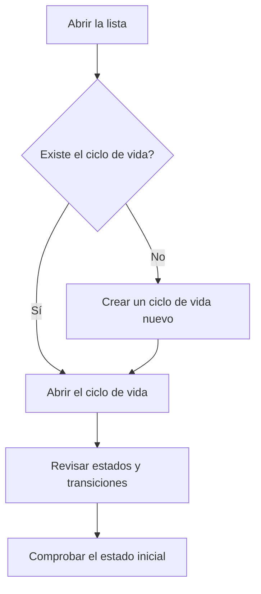

# Gestión de ciclos de vida

## Para qué sirve esta pantalla

Lista los ciclos de vida de la aplicación. Cada ciclo de vida define los estados por los que pasa un tipo de documento y las transiciones permitidas entre ellos: presupuestos, pedidos, albaranes, facturas, pedidos de compra, recepciones, órdenes de fabricación (OF) y el envío a Verifactu. Es una pantalla de configuración para el administrador: lo que se cambia aquí afecta a todos los documentos del tipo correspondiente.

## Acciones disponibles

- Consultar cada ciclo de vida con su «Nombre», la «Descripción» y el «Estado Inicial».
- Crear un ciclo de vida nuevo con el botón «+» («Crear nuevo»).
- Abrir un ciclo de vida haciendo clic en la fila para editar sus estados, transiciones y etiquetas.
- Eliminar un ciclo de vida con el icono de la papelera de la fila.

## Flujo habitual

1. Abre la lista y localiza el ciclo de vida del documento que quieres revisar (por ejemplo, el de las órdenes de fabricación).
2. Haz clic en la fila para abrirlo.
3. Revisa o ajusta los estados, las transiciones y las etiquetas en la ficha.
4. Vuelve a la lista y comprueba que la columna «Estado Inicial» muestra el estado esperado.

## Aspectos importantes

- El programa busca cada ciclo de vida por su nombre interno (por ejemplo, `Budget`, `SalesOrder`, `DeliveryNote`, `SalesInvoice`, `PurchaseOrder`, `PurchaseOrderDetail`, `PurchaseInvoice`, `Receipts`, `WorkOrder` o `Verifactu`). No cambies estos nombres ni los elimines: los documentos de ese tipo dejarían de poder crearse o de cambiar de estado.
- Crear un ciclo de vida nuevo con otro nombre no hace que ningún documento lo use: los documentos solo usan los ciclos de vida con el nombre que el programa espera.
- La columna «Estado Inicial» es el estado que reciben los documentos nuevos. Si está vacía, la creación de esos documentos falla.
- Solo se puede eliminar un ciclo de vida que no tenga ningún estado ni ninguna transición. La eliminación es definitiva y no pide confirmación.

## Errores frecuentes

- Si al eliminar aparece «El ciclo de vida ... tiene dependencias», el ciclo de vida todavía tiene estados o transiciones. Normalmente significa que está en uso: no lo elimines.
- Si al crear un ciclo de vida aparece que la entidad ya existe, ya hay uno con el mismo nombre.
- Si al crear un documento aparece que el ciclo de vida no tiene un estado inicial, abre ese ciclo de vida e informa el «Estado inicial».

## Proceso básico

