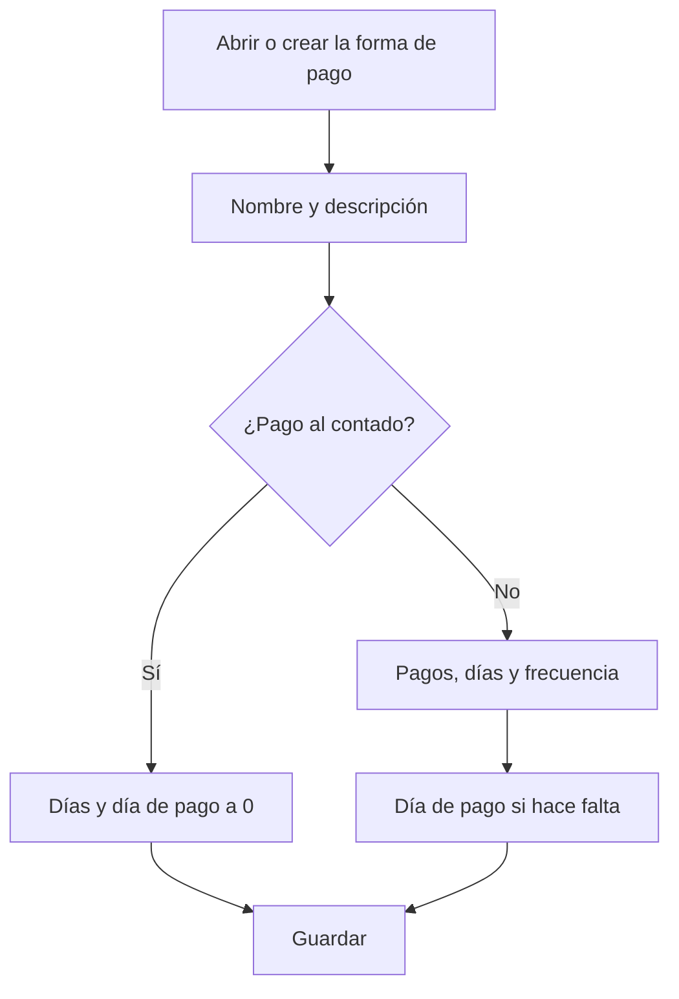

# Forma de pago

## Para qué sirve esta pantalla

Es la ficha de una forma de pago. Aquí defines cómo se reparte el importe de una factura en vencimientos y en qué fechas vencen. La forma de pago se asigna al cliente o al proveedor y a cada factura, y el programa calcula los vencimientos a partir de la fecha y del importe total de la factura.

## Acciones disponibles

- Rellenar «Nombre» y «Descripción» para identificar la forma de pago en los selectores.
- Definir el cálculo de los vencimientos con «Días vencimiento», «Día de pago», «Número de pagos» y «Frecuencia».
- Marcar «Desactivada» para que deje de ofrecerse en clientes y facturas.
- Guardar con «Guardar», en la cabecera. Al guardar, vuelves a la pantalla anterior.

## Flujo habitual

1. Desde «Formas de pago», pulsa «+» o abre una forma de pago existente.
2. Escribe el nombre y la descripción, por ejemplo «30-60-90» y «Tres pagos a 30, 60 y 90 días».
3. Indica el número de pagos y los días entre vencimientos.
4. Si los pagos deben hacerse un día concreto del mes, indícalo en «Día de pago»; si no, deja 0.
5. Pulsa «Guardar».

## Aspectos importantes

- Todos los campos son obligatorios, excepto «Desactivada». «Nombre» y «Descripción» admiten hasta 250 caracteres.
- Pago al contado: si «Días vencimiento» y «Día de pago» son 0, la factura tiene un único vencimiento por el importe total en la misma fecha de la factura.
- En los demás casos se generan tantos vencimientos como indica «Número de pagos». El importe total se reparte a partes iguales y cada parte se redondea a céntimos, así que la suma puede diferir en un céntimo.
- Cada vencimiento se calcula a partir del anterior (el primero, a partir de la fecha de la factura) sumando los días de «Frecuencia». Si «Frecuencia» es 0, se suman los «Días vencimiento».
- Atención: cuando «Frecuencia» es mayor que 0, también el primer vencimiento usa la frecuencia y «Días vencimiento» no se utiliza.
- Si los días son múltiplo de 30 (30, 60, 90...), se suman meses completos en lugar de días. Una factura del 15 de marzo a 30 días vence el 15 de abril.
- Si «Día de pago» es mayor que 0, cada vencimiento se mueve a ese día del mes: el mismo mes si todavía no ha pasado, o el mes siguiente si ya ha pasado. Si el mes no tiene ese día (por ejemplo, el 31 en febrero), se toma el último día del mes.
- Ejemplo: una factura del 15 de marzo a 30 días con día de pago 10 vence el 10 de mayo, porque el 15 de abril ya ha pasado el día 10.
- Una forma de pago nueva empieza con «Día de pago» a 1. Para un pago al contado, pon 0.
- Los vencimientos de una factura de venta se vuelven a calcular cada vez que se guarda la factura. En las facturas de compra se proponen automáticamente cuando hay proveedor, forma de pago y un impuesto en cada importe.

## Errores frecuentes

- Si una factura se queda sin vencimientos, comprueba que «Número de pagos» sea como mínimo 1.
- Si los vencimientos caen un mes más tarde de lo previsto, revisa «Día de pago»: cuando el día ya ha pasado, el vencimiento salta al mes siguiente.
- Si el primer vencimiento no respeta «Días vencimiento», revisa «Frecuencia»: si no es 0, es la que manda.
- Si en una factura de compra aparece «El método de pago con ID ... no existe o está desactivado», la forma de pago está desactivada. Vuelve a activarla o elige otra en la factura.

## Proceso básico

