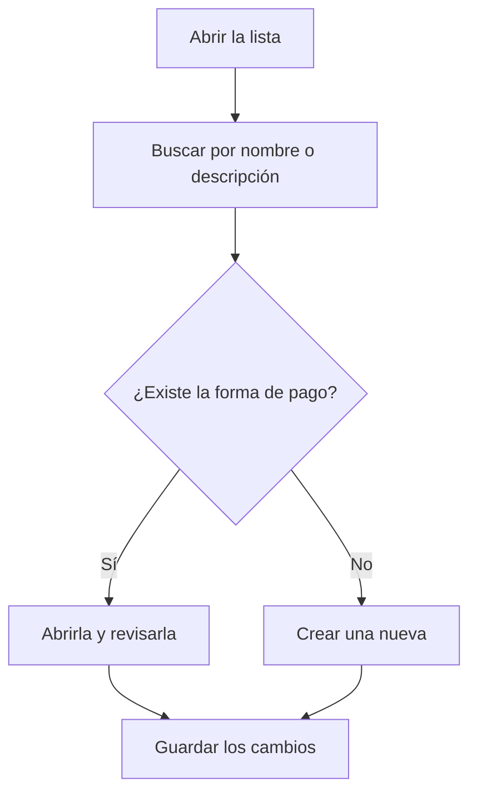

# Formas de pago

## Para qué sirve esta pantalla

Lista las formas de pago que se asignan a clientes, proveedores y facturas. Cada forma de pago decide cómo se calculan los vencimientos de una factura: cuántos pagos hay, a cuántos días y en qué día del mes. Desde aquí consultas su configuración de un vistazo y creas otras nuevas. El significado de cada campo se explica en la ayuda de la ficha «Forma de pago».

## Acciones disponibles

- Buscar por nombre o descripción con el filtro «Buscar». La lista se filtra mientras escribes.
- Borrar la búsqueda con el botón «Limpiar filtros».
- Crear una forma de pago nueva con el botón verde «+» («Crear nuevo»).
- Abrir una forma de pago haciendo clic en su fila para consultarla o modificarla.

## Flujo habitual

1. Abre la lista de formas de pago.
2. Escribe parte del nombre o de la descripción en «Buscar» para encontrar la que buscas.
3. Revisa las columnas «Días vencimiento» y «Día pago» para ver cómo vence cada forma de pago.
4. Si no hay ninguna que encaje, pulsa «+» para crear una nueva.
5. Rellena la ficha y guárdala; volverás a la lista con el cambio aplicado.

## Aspectos importantes

- La lista muestra todas las formas de pago ordenadas por nombre, también las desactivadas. La columna «Desactivada» indica cuáles lo están.
- Esta pantalla no permite eliminar formas de pago. Para dejar de usar una, ábrela y marca «Desactivada».
- Las formas de pago desactivadas no se ofrecen al elegir la forma de pago en la ficha de cliente ni en las facturas de venta y de compra.
- Modificar una forma de pago no cambia los vencimientos ya calculados. Los vencimientos de una factura de venta se vuelven a calcular cada vez que se guarda la factura, y entonces ya usan la configuración nueva.

## Errores frecuentes

- Si no encuentras una forma de pago, borra la búsqueda con «Limpiar filtros»: el filtro solo busca en el nombre y la descripción.
- Si una forma de pago no aparece en el selector de un cliente o de una factura, comprueba que no esté marcada como «Desactivada».
- Si los vencimientos de una factura no son los que esperabas, abre la forma de pago y revisa «Días vencimiento», «Día de pago», «Número de pagos» y «Frecuencia».

## Proceso básico

