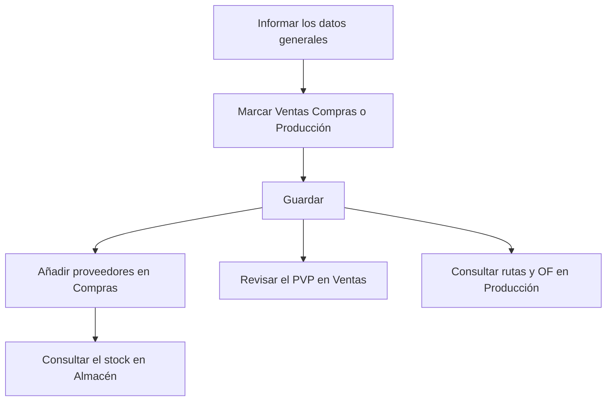

# Referencia

## Para qué sirve esta pantalla

Es la ficha unificada de una referencia. Reúne en una sola pantalla lo que las fichas de «Referencias de venta» y «Referencias de compra» muestran por separado: los datos generales, el precio de venta, los proveedores y sus tarifas, las rutas y las órdenes de fabricación (OF) y el stock por ubicación. Las casillas «Ventas», «Compras» y «Producción» deciden en qué ámbitos se usa la referencia y qué pestañas se muestran.

## Acciones disponibles

- **«General»**: informar el «Código», la «Descripción», la «Versión», el «Tipo de material», el «Formato», el «Cliente», el «Impuesto» y el «PVP», marcar las casillas «Activa», «Ventas», «Compras», «Producción», «Servicio» y «Requiere lote», y guardar con «Guardar».
- En «General», subir, consultar y eliminar archivos en «Documentación» (solo cuando la referencia ya está creada).
- **«Ventas»**: cambiar el «PVP» y guardarlo con «Guardar PVP», y consultar el «Histórico de ventas (albaranes)».
- **«Compras»**: consultar el «PUC (último coste de compra)» y las subpestañas:
  - «Proveedores y tarifas»: añadir un proveedor con «+», editarlo con el lápiz o eliminarlo con la «X».
  - «Tarifas de servicios externos»: consultar las líneas de tarifas de compra de los proveedores que incluyen esta referencia.
  - «Tarifas de transporte»: consultar las tarifas de transporte de los proveedores asignados.
  - «Histórico de compras»: consultar las líneas de recepción de esta referencia.
- **«Producción»**: consultar las «Rutas de fabricación» y las «Órdenes de fabricación (OFs)» de la referencia, y abrirlas haciendo clic en la fila.
- **«Almacén»**: consultar el «Stock por ubicación», con el almacén, la ubicación, la cantidad y las medidas (ancho, largo, alto, diámetro y grosor).

## Flujo habitual

1. Crea la referencia desde «Gestión de referencias» o abre una existente.
2. En «General», informa el código, la descripción, la versión y el impuesto, y marca «Ventas», «Compras» o «Producción» según el uso.
3. Guarda con «Guardar». En una referencia nueva, en ese momento aparecen las demás pestañas.
4. Si se compra, ve a «Compras» > «Proveedores y tarifas» y añade los proveedores con su código, precio y días de entrega.
5. Si se vende, revisa el «PVP» en «Ventas».
6. Si se fabrica, consulta en «Producción» las rutas y las OF, y abre la ruta para revisar sus costes.

## Aspectos importantes

- **Pestañas según el uso**: «Ventas», «Compras» y «Producción» solo aparecen cuando la referencia ya está creada y la casilla correspondiente está marcada; «Almacén» aparece siempre que la referencia existe. Los datos de cada pestaña se cargan al abrir la ficha: si marcas una casilla nueva, guarda y vuelve a abrir la referencia para ver sus datos.
- **Categoría**: esta pantalla no permite elegir la categoría. Las referencias nuevas se crean como productos; los materiales, herramientas y servicios se dan de alta en «Referencias de compra». Si abres aquí un material existente, conserva su categoría.
- **Versiones**: la misma referencia puede tener varias versiones con el mismo código. Las referencias de venta se muestran con el código seguido de «(v. versión)». Una referencia nueva empieza con la versión «1».
- **Código con tipo**: si la referencia es de compra pero no de venta y tiene un «Tipo de material», al guardar el programa añade el nombre del tipo entre paréntesis al final del código.
- **Costes automáticos**: el «Coste Teórico Fabricación» y el «Coste Última Fabricación / Compra» no se pueden editar. El primero se actualiza cada vez que se guarda una ruta de fabricación de la referencia, con los costes de esa ruta; el segundo, cuando se actualiza una OF de esta referencia o se guarda una recepción que la contiene. El «PUC (último coste de compra)» de la pestaña «Compras» muestra ese mismo valor.
- **Recepciones y proveedores**: al guardar una recepción, el programa actualiza el precio del proveedor de esta referencia y, si el proveedor no estaba, lo añade a «Proveedores y tarifas». Para los materiales, si el «Formato» no es el de unidades, el precio que se guarda es por kilo.
- **«Guardar PVP»** guarda toda la ficha, no solo el precio: también los cambios pendientes de la pestaña «General».
- **Tarifas**: las tarifas de servicios externos y de transporte solo se consultan aquí. Se mantienen en la ficha del proveedor, en las pestañas «Tarifas de compra» y «Tarifas de transporte».
- **Producción**: aquí solo se consultan las rutas y las OF. Para crear una ruta de fabricación nueva, hazlo desde la ficha de la referencia en «Referencias de venta». El «Coste total OF» suma los costes de operario, máquina y material.
- **«Requiere lote»**: con la casilla marcada, el programa asigna un lote a las entradas y salidas de esta referencia (OF, recepciones y albaranes) para la trazabilidad.
- **Stock**: la pestaña «Almacén» es solo de consulta. El stock lo mueven los documentos (recepciones, OF y albaranes), no esta ficha.
- **Documentación**: los archivos son los mismos que se ven en la ficha de «Referencias de venta».
- **Activar y desactivar**: esta pantalla no elimina referencias. Para retirar una, desmarca «Activa» y guarda.

## Errores frecuentes

- Si no ves la pestaña «Ventas», «Compras» o «Producción», comprueba que la casilla correspondiente esté marcada y que la referencia esté guardada.
- Si al guardar aparece un error, comprueba que el «Código», la «Descripción» y la «Versión» estén informados. La «Versión» admite como máximo 10 caracteres y el «Código», 50.
- Si el código ha cambiado al guardar y ahora termina con un texto entre paréntesis, es el «Tipo de material» que se añade a las referencias solo de compra.
- Si al guardar un proveedor aparece «Selecciona un proveedor», elige uno en el desplegable «Proveedor».
- Si los históricos o las tarifas aparecen vacíos justo después de marcar una casilla, guarda y vuelve a abrir la referencia.
- Si «Tarifas de transporte» aparece vacío, comprueba que la referencia tenga proveedores en «Proveedores y tarifas» y que esos proveedores tengan tarifas de transporte.

## Proceso básico

