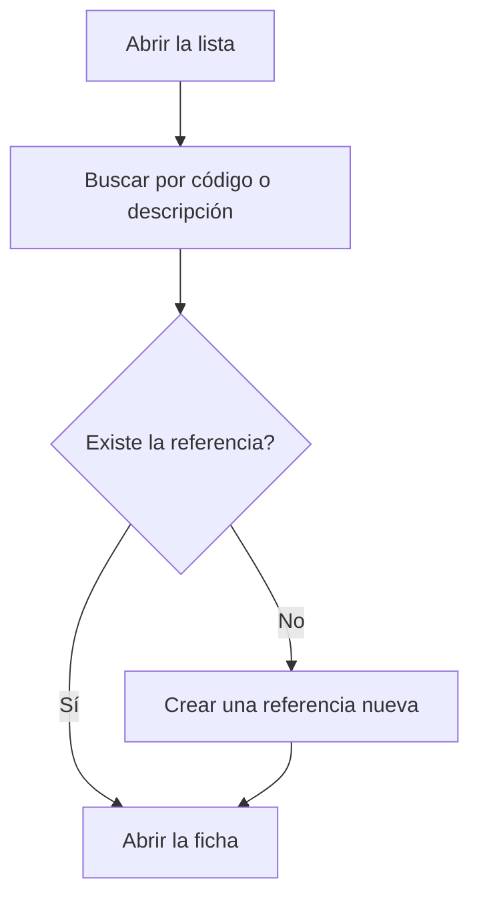

# Gestión de referencias

## Para qué sirve esta pantalla

Lista todas las referencias de la empresa en un solo lugar, sean de venta, de compra o de producción. A diferencia de «Referencias de venta» y «Referencias de compra», que muestran solo su parte, aquí se ven todas juntas y se abre una ficha unificada con pestañas para ventas, compras, producción y almacén.

## Acciones disponibles

- Buscar por código o descripción con el campo «Buscar...».
- Borrar la búsqueda con el botón «Limpiar filtros».
- Ordenar por «Código» o por «Descripción» haciendo clic en la cabecera de la columna.
- Consultar en las columnas «Ventas», «Compras» y «Producción» en qué ámbitos se usa cada referencia, y en «Activa» si está activa.
- Crear una referencia nueva con el botón «+» («Crear nuevo»).
- Abrir una referencia haciendo clic en la fila.

## Flujo habitual

1. Escribe parte del código o de la descripción en «Buscar...».
2. Revisa la «Versión» y las columnas «Ventas», «Compras» y «Producción» para encontrar la referencia correcta.
3. Haz clic en la fila para abrir su ficha.
4. Si no existe, créala con el botón «+» e informa los datos generales.

## Aspectos importantes

- La lista incluye referencias de todas las categorías: productos, materiales, herramientas y servicios.
- La búsqueda solo mira el código y la descripción, y no distingue mayúsculas y minúsculas.
- Una misma referencia puede tener varias versiones: cada versión aparece en una fila propia con el mismo código.
- Desde esta lista no se pueden eliminar referencias. Para retirar una, desmarca «Activa» en la ficha; la referencia sigue en la lista con «Activa» sin marcar.
- Las referencias nuevas que se crean desde aquí son productos. Para dar de alta materiales, herramientas o servicios de compra, usa «Referencias de compra».

## Errores frecuentes

- Si no encuentras una referencia, borra la búsqueda y prueba con una parte más corta del código o de la descripción.
- Si ves dos filas con el mismo código, comprueba la columna «Versión»: son versiones distintas de la misma referencia.
- Si una referencia aparece con un sufijo entre paréntesis en el código, es el tipo de material que el programa añade a las referencias solo de compra.

## Proceso básico

