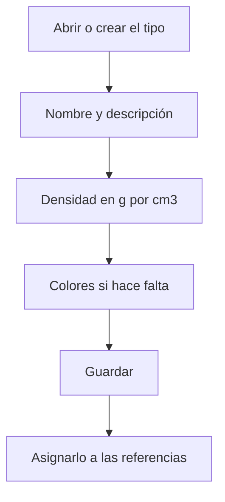

# Tipo de material

## Para qué sirve esta pantalla

Es la ficha de un tipo de material. En ella defines el nombre, la descripción y, sobre todo, la densidad del material. Las referencias de materia prima que tienen este tipo en el campo «Tipo de material» usan esta densidad para convertir medidas en peso, y del peso salen precios y costes.

## Acciones disponibles

- Rellenar «Nombre» y «Descripción».
- Indicar la «Densidad g/cm^3» del material.
- Elegir un «Color Primario» y un «Color Secundario» con el selector de color.
- Marcar «Desactivado».
- Guardar con «Guardar», en la cabecera. Al guardar, vuelves a la pantalla anterior.

## Flujo habitual

1. Desde «Tipos de materias primas», pulsa «+» o abre el tipo que quieres revisar.
2. Escribe el nombre y la descripción, por ejemplo «INOX» y «Acero inoxidable».
3. Escribe la densidad en g/cm³, por ejemplo 7.93.
4. Si hace falta, elige los colores.
5. Pulsa «Guardar».

## Aspectos importantes

- «Nombre» y «Descripción» son obligatorios y admiten hasta 250 caracteres. En el selector «Tipo de material» de las referencias, el tipo se muestra como «nombre - descripción».
- La densidad se escribe en g/cm³ y con punto decimal. Las medidas se introducen en milímetros y, con la densidad en esta unidad, el peso sale en kilos.
- En las líneas de «Albaranes de compra» de material, el peso unitario se calcula con las medidas de la línea, el formato de la referencia (placa, redondo o tubo) y la densidad. El precio de la línea es el precio por kilo multiplicado por el peso.
- En los presupuestos, el peso de cada línea se calcula con la densidad y el volumen de la ruta de fabricación.
- El coste real de material de las órdenes de fabricación también se calcula con el peso cuando la referencia tiene formato de placa, redondo o tubo.
- Si cambias la densidad, los cálculos que se hagan a partir de ese momento usarán el valor nuevo; los pesos ya calculados no cambian.

## Errores frecuentes

- Si al calcular el peso de una línea de albarán de compra aparece «Referencia sin tipo», asigna un tipo de material a la referencia.
- Si aparece un aviso de que las medidas y la densidad deben ser superiores a 0, comprueba que la densidad del tipo no sea 0 y que la línea tenga todas las medidas.
- Si los pesos salen mil veces más grandes o más pequeños, revisa que la densidad esté en g/cm³ (por ejemplo 7.85 para el acero, no 7850).

## Proceso básico

