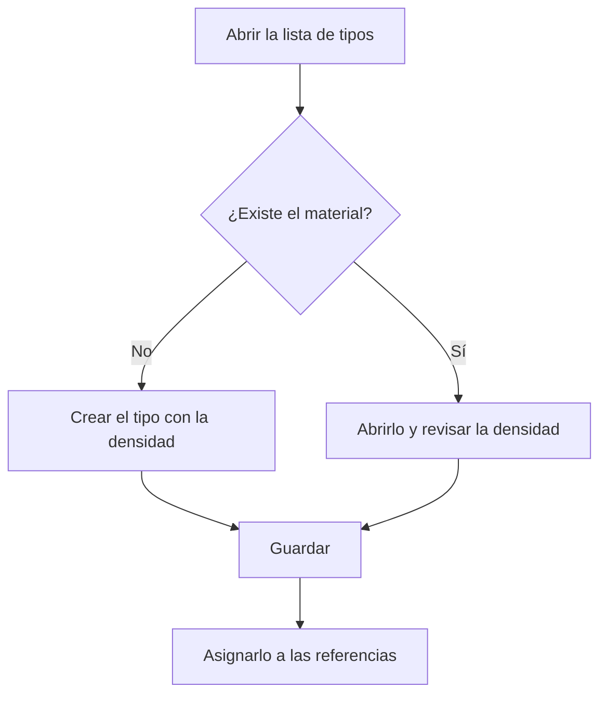

# Tipos de materias primas

## Para qué sirve esta pantalla

Lista los tipos de material (por ejemplo, acero, aluminio o latón) con los que se clasifican las referencias de materia prima. Cada tipo guarda la densidad del material, que el programa usa para calcular pesos a partir de las medidas: en las líneas de albaranes de compra, en los presupuestos y en el coste de material de las órdenes de fabricación. El tipo se asigna a cada referencia en el campo «Tipo de material» de su ficha.

## Acciones disponibles

- Consultar el nombre, la descripción, la densidad y si el tipo está «Desactivada».
- Ordenar la lista por «Nombre» o por «Descripción» pulsando la cabecera de la columna. Por defecto se ordena por nombre.
- Crear un tipo nuevo con el botón verde «+» («Crear nuevo»).
- Abrir un tipo haciendo clic en su fila para modificarlo.
- Eliminar un tipo con el icono de la papelera de la fila y confirmarlo.

## Flujo habitual

1. Abre la lista de tipos de materiales.
2. Comprueba si ya existe el material que necesitas.
3. Si no está, pulsa «+» y créalo con su densidad.
4. Guárdalo; volverás a la lista con el tipo nuevo.
5. Asigna el tipo a las referencias desde el campo «Tipo de material» de la ficha de referencia.

## Aspectos importantes

- La densidad se guarda en g/cm³, la misma unidad que muestra la ficha del tipo, aunque la cabecera de la columna indique otra unidad.
- La eliminación es definitiva. No se puede eliminar un tipo que está asignado a alguna referencia: antes hay que cambiarlo en las referencias.
- Marcar un tipo como desactivado no lo oculta del selector «Tipo de material» de las referencias.
- Al eliminarlo correctamente, aparece el aviso «Eliminado» y la lista se vuelve a cargar.

## Errores frecuentes

- Si no puedes eliminar un tipo, comprueba si alguna referencia lo tiene asignado en el campo «Tipo de material» y cámbiaselo antes.
- Si el peso calculado de un material es incorrecto, abre el tipo de la referencia y revisa su densidad.

## Proceso básico

