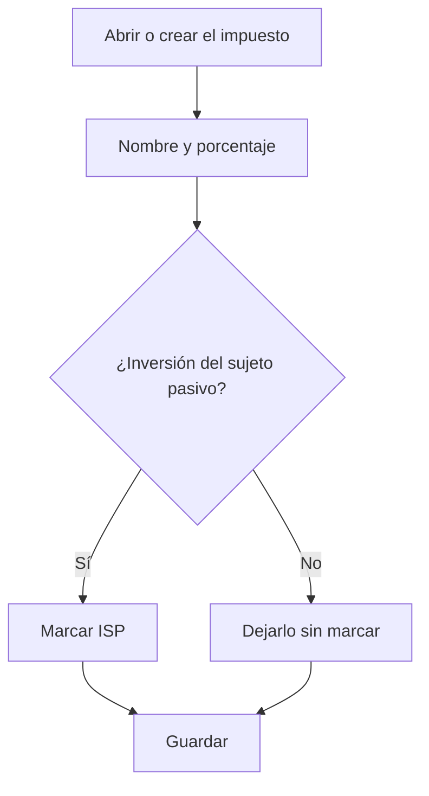

# Impuesto

## Para qué sirve esta pantalla

Es la ficha de un impuesto. En ella defines el nombre, el porcentaje y si es de inversión del sujeto pasivo. Este impuesto es el que después se elige en las líneas de las facturas de venta, en los importes de las facturas de compra y en la ficha de las referencias, y determina la cuota de impuesto de cada factura.

## Acciones disponibles

- Rellenar «Nombre» y «Porcentaje».
- Marcar «Inversión del sujeto pasivo (ISP)» para los impuestos en los que la cuota no se cobra en la factura.
- Marcar «Desactivada» para que deje de ofrecerse en las facturas.
- Guardar con «Guardar», en la cabecera. Al guardar, vuelves a la pantalla anterior.

## Flujo habitual

1. Desde «Impuestos», pulsa «+» o abre el impuesto que quieres revisar.
2. Escribe un nombre claro, por ejemplo «IVA 21%».
3. Indica el porcentaje.
4. Si es un impuesto de inversión del sujeto pasivo, marca «Inversión del sujeto pasivo (ISP)».
5. Pulsa «Guardar».

## Aspectos importantes

- «Nombre» y «Porcentaje» son obligatorios. El nombre admite hasta 250 caracteres. Los decimales del porcentaje se escriben con punto.
- La cuota de impuesto es la base multiplicada por el porcentaje y dividida entre 100.
- Si el impuesto es de inversión del sujeto pasivo, la cuota siempre es 0, sea cual sea el porcentaje. En Verifactu, estas líneas se declaran como inversión del sujeto pasivo, con cuota 0.
- En las facturas de venta, los importes se agrupan por impuesto: cada impuesto distinto de las líneas genera una base y una cuota propias.
- Las facturas guardan qué impuesto tiene cada línea, no una copia del porcentaje. Si cambias el porcentaje de un impuesto ya usado y se vuelven a calcular los importes de una factura antigua, se le aplicará el porcentaje nuevo. Si el tipo cambia, es mejor crear un impuesto nuevo y desactivar el antiguo.
- Un impuesto desactivado no se ofrece en las líneas de las facturas de venta ni en los importes de las facturas de compra.
- Al facturar un albarán, las líneas de referencias sin impuesto toman el impuesto del 21 %.

## Errores frecuentes

- Si al guardar aparece «El porcentaje es obligatorio», escribe un número en el campo «Porcentaje», aunque sea 0.
- Si una factura con este impuesto muestra cuota 0, comprueba si está marcado «Inversión del sujeto pasivo (ISP)».
- Si al importar una factura de compra no se reconoce el impuesto, comprueba que exista un impuesto con el mismo porcentaje que la factura y que no haya dos iguales.

## Proceso básico

