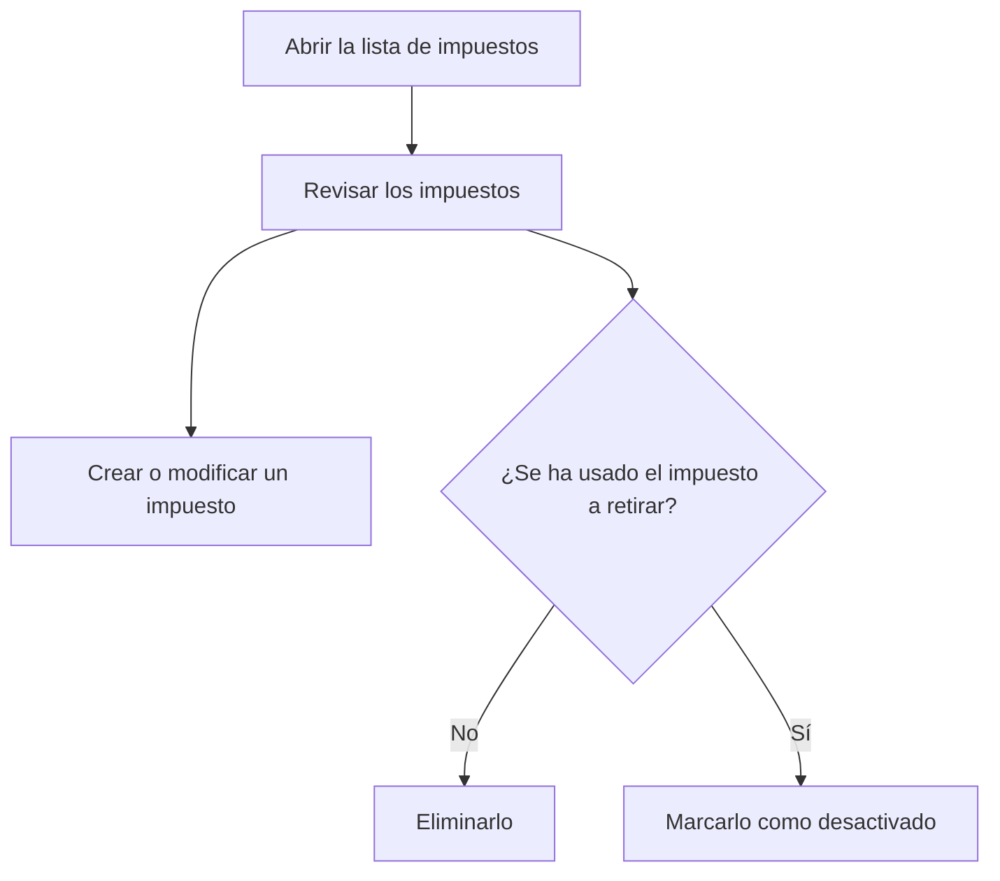

# Impuestos

## Para qué sirve esta pantalla

Lista los impuestos (por ejemplo, el IVA al 21 %) que se aplican a las líneas de las facturas de venta, a los importes de las facturas de compra y a las referencias. Cada impuesto tiene un porcentaje y puede ser de inversión del sujeto pasivo. Desde aquí creas impuestos nuevos, los abres para modificarlos y eliminas los que no se han usado nunca.

## Acciones disponibles

- Consultar el nombre, el «% Porcentaje», si es de «Inversión sujeto pasivo» y si está «Desactivada».
- Crear un impuesto nuevo con el botón verde «+» («Crear nuevo»).
- Abrir un impuesto haciendo clic en su fila para modificarlo.
- Eliminar un impuesto con el icono de la papelera de la fila y confirmarlo.

## Flujo habitual

1. Abre la lista de impuestos.
2. Comprueba que existan los impuestos que necesitas, como mínimo el IVA al 21 %.
3. Pulsa «+» para crear uno nuevo, o abre uno para cambiarlo.
4. Rellena la ficha y guárdala; volverás a la lista con el cambio aplicado.
5. Para dejar de usar un impuesto que ya tiene movimientos, ábrelo y marca «Desactivada» en lugar de eliminarlo.

## Aspectos importantes

- La eliminación es definitiva. No se puede eliminar un impuesto que alguna referencia tiene asignado ni un impuesto que ya se ha usado en facturas de venta o de compra: para dejar de usarlo, márcalo como «Desactivada».
- Los impuestos desactivados no se ofrecen en las líneas de las facturas de venta ni en los importes de las facturas de compra, pero siguen apareciendo en el selector «Impuesto» de la ficha de referencia.
- Al facturar un albarán, cada línea toma el impuesto de su referencia. Si la referencia no tiene, se aplica el impuesto del 21 %, así que debe existir uno.
- Al importar una factura de compra desde un PDF, los impuestos se reconocen por el porcentaje. Evita tener dos impuestos con el mismo porcentaje; si hay dos con el mismo porcentaje y uno es de inversión del sujeto pasivo, se elige el otro.
- La lista se vuelve a cargar cuando regresas a ella desde la ficha de un impuesto.

## Errores frecuentes

- Si al eliminar aparece «No se ha podido eliminar el impuesto», el impuesto está en uso en alguna referencia o factura: desactívalo en lugar de eliminarlo.
- Si al facturar un albarán aparece «No existe el impuesto IVA 21%», crea un impuesto con porcentaje 21.
- Si un impuesto no aparece en una factura, comprueba que no esté marcado como «Desactivada».

## Proceso básico

