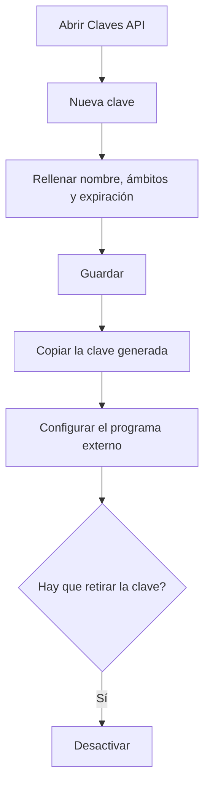

# Claves API

## Para qué sirve esta pantalla

Aquí se crean y se desactivan las claves que usan otros programas (integraciones, scripts, servicios externos) para conectarse al ERP sin usuario ni contraseña. Cada clave se identifica por su nombre y su prefijo, y puede tener fecha de expiración. La clave completa solo se muestra una vez, en el momento de crearla.

## Acciones disponibles

- Consultar las claves existentes con su nombre, descripción, «Prefijo», «Ámbitos», la fecha en «Expira» y el «Estado» («Activa» o «Inactiva»).
- Crear una clave con «Nueva clave»: se abre el diálogo «Nueva clave API» con «Nombre», «Descripción», «Ámbitos (scopes)» y «Fecha de expiración», y se guarda con «Guardar».
- Copiar la clave generada con el botón de copiar del diálogo «Clave API generada».
- Desactivar una clave con el botón «Desactivar» de la fila y confirmarlo en el mensaje «Desactivar clave API».

## Flujo habitual

1. Pulsa «Nueva clave».
2. Escribe un «Nombre» que identifique claramente quién usará la clave (por ejemplo, el nombre de la integración) y, si hace falta, una «Descripción».
3. Rellena los «Ámbitos (scopes)» solo si la integración los necesita y, si quieres que caduque, elige la «Fecha de expiración».
4. Pulsa «Guardar».
5. En el diálogo «Clave API generada», copia la clave y guárdala en un lugar seguro.
6. Pulsa «He guardado la clave» y configura la clave en el programa externo.
7. Cuando la integración ya no se vaya a usar, o si la clave se ha filtrado, desactívala.

## Aspectos importantes

- La clave completa solo se ve en el diálogo «Clave API generada». El ERP no la guarda en claro: una vez cerrado el diálogo no se puede volver a consultar. Si se pierde, hay que crear una nueva y desactivar la antigua.
- La clave empieza por «rs_» seguido del prefijo que aparece en la columna «Prefijo». Así puedes saber qué clave usa cada programa sin verla entera.
- El programa externo debe enviar la clave en cada petición a la API, en la cabecera «X-Api-Key».
- Trata la clave como una contraseña. Una clave activa da acceso a la API aunque no tenga ningún ámbito.
- Los ámbitos se escriben separados por comas. Actualmente el único ámbito que el sistema tiene en cuenta es «branding.write», que permite modificar el «Branding». El resto de ámbitos se guardan pero no limitan el acceso.
- Si no pones fecha de expiración, la clave no caduca nunca (en la lista aparece «Nunca»). Si pones una, la clave deja de funcionar al llegar esa fecha.
- El «Estado» solo indica si la clave se ha desactivado. Una clave caducada sigue apareciendo como «Activa», pero ya no permite conectarse: mira también la columna «Expira».
- Desactivar es definitivo: una clave «Inactiva» no se puede volver a activar ni editar. Las claves no se borran; quedan en la lista como «Inactiva».
- Una vez creada, una clave no se puede modificar (ni el nombre, ni los ámbitos, ni la fecha de expiración). Para cambiar algo, crea una nueva y desactiva la anterior.

## Errores frecuentes

- Si al guardar aparece «Error al crear la clave API», comprueba primero que no exista ya una clave con el mismo nombre, aunque esté inactiva: los nombres no se pueden repetir.
- Si el diálogo no deja guardar, revisa que el «Nombre» esté rellenado («El nombre es obligatorio»).
- Si un programa externo deja de conectarse, comprueba en la lista que la clave no esté «Inactiva» y que la fecha de «Expira» no haya pasado.
- Si has cerrado el diálogo sin copiar la clave, no podrás recuperarla: crea una nueva y desactiva la que no pudiste guardar.

## Proceso básico

