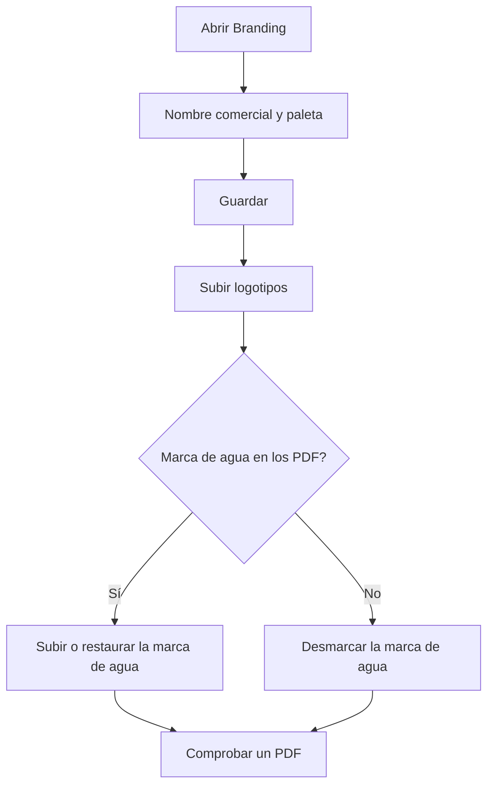

# Branding

## Para qué sirve esta pantalla

Aquí se configura la imagen de la empresa en la aplicación y en los documentos PDF: el nombre comercial, la paleta de color, los logotipos y la marca de agua. Los cambios afectan a todos los usuarios: la barra lateral, la pantalla de inicio de sesión, la pantalla de inicio y los PDF de presupuestos, pedidos, albaranes, facturas y órdenes de fabricación. Solo los administradores pueden hacer cambios; el resto de usuarios ven la configuración en modo consulta.

## Acciones disponibles

- Cambiar el «Nombre comercial» y la «Paleta de color» (Negro, Azul, Índigo, Esmeralda, Turquesa, Violeta, Naranja o Rosa) y guardarlo con «Guardar», en la cabecera.
- Subir el «Logotipo principal» con «Seleccionar», o quitarlo con «Eliminar».
- Subir el «Logotipo de la barra lateral» con «Seleccionar», o quitarlo con «Eliminar».
- Activar o desactivar «Mostrar la marca de agua» en el apartado «Documentos PDF».
- Subir una marca de agua propia con «Seleccionar», o volver a la de fábrica con «Restaurar la predeterminada».

## Flujo habitual

1. Abre «Branding».
2. Escribe el «Nombre comercial» y elige la «Paleta de color».
3. Pulsa «Guardar» en la cabecera.
4. Sube el «Logotipo principal» y, si el logotipo no se lee bien sobre el fondo oscuro de la barra lateral, sube también un «Logotipo de la barra lateral».
5. En «Documentos PDF», decide si quieres «Mostrar la marca de agua» y, si hace falta, sube la tuya.
6. Genera un PDF (por ejemplo, un presupuesto) para comprobar el resultado.

## Aspectos importantes

- Los logotipos y la marca de agua se guardan en el momento de elegir el archivo, y la casilla «Mostrar la marca de agua» se guarda al marcarla o desmarcarla. Solo el nombre comercial y la paleta necesitan «Guardar».
- Formatos admitidos: PNG, JPG/JPEG y WebP, de 2 MB como máximo. La extensión del archivo debe corresponder a su contenido real. La marca de agua solo admite PNG o WebP con fondo transparente.
- El «Nombre comercial» puede tener hasta 60 caracteres. Si lo dejas vacío, se usa el nombre por defecto. Aparece en la barra lateral, en la pestaña del navegador, en las pantallas de inicio de sesión y de inicio, y como autor de los PDF.
- La paleta cambia el color principal de toda la aplicación (botones y elementos destacados) y los detalles de color de los PDF (título, líneas y cabeceras de tabla). Tú lo ves al instante; el resto de usuarios, cuando vuelvan a cargar la aplicación.
- El «Logotipo principal» aparece en la pantalla de inicio de sesión, en la pantalla de inicio y en todos los PDF. Sin logotipo propio se usa el de fábrica.
- El «Logotipo de la barra lateral» se muestra sobre fondo oscuro. Si no hay ninguno, la barra lateral usa el logotipo principal y, si tampoco lo hay, el de fábrica.
- La marca de agua se imprime en el centro de la página, por encima del contenido, en los presupuestos, pedidos de venta, albaranes, facturas de venta y pedidos de compra. Las órdenes de fabricación no la llevan. Por eso debe tener fondo transparente: una imagen opaca (por ejemplo, un JPG) se rechaza porque taparía el texto.
- Con «Mostrar la marca de agua» desmarcada, los PDF no llevan ninguna marca de agua y no se puede subir una nueva. Marcada y sin imagen propia, se imprime la «Marca de agua por defecto».
- Al sustituir o eliminar un logotipo o la marca de agua, el archivo anterior se borra del servidor y no se puede recuperar. Guarda una copia antes si quieres conservarlo.
- La configuración es de la empresa activa. Si en «Empresas» hay más de una activa, la aplicación muestra la imagen por defecto y los cambios no se pueden guardar.

## Errores frecuentes

- Si aparece «No tienes permisos para modificar el Branding.», hace falta un usuario administrador para hacer cambios.
- Si aparece «El logotipo no puede superar los 2 MB», reduce el tamaño de la imagen; pasa también con la marca de agua.
- Si al subir una imagen se rechaza, el mensaje explica el motivo: comprueba que sea PNG, JPG o WebP, que la extensión coincida con el formato real (por ejemplo, un PNG renombrado a .jpg se rechaza) y, para la marca de agua, que tenga fondo transparente.
- Si al guardar también aparece «No se ha podido actualizar el Branding.», comprueba en «Empresas» que solo haya una activa.
- Si no puedes elegir una marca de agua, marca antes «Mostrar la marca de agua».
- Si otro usuario todavía ve los colores antiguos, tiene que volver a cargar la aplicación.

## Proceso básico

