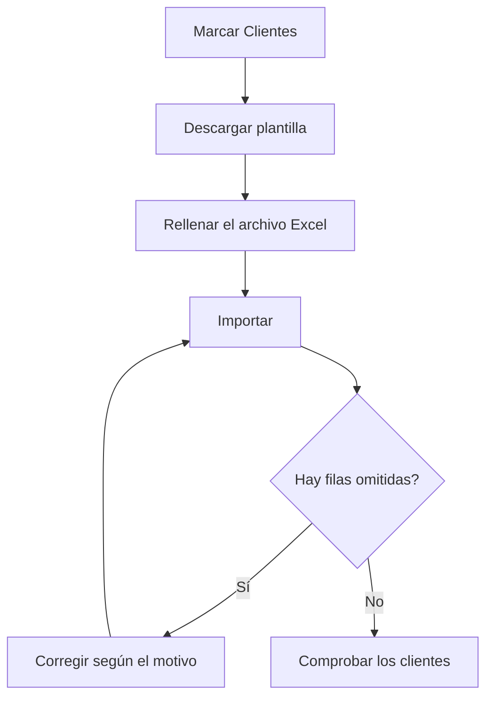

# Importación / Exportación de datos

## Para qué sirve esta pantalla

Sirve para cargar datos de golpe desde un archivo Excel, por ejemplo al poner en marcha el ERP con los datos de un programa anterior, y para exportar a Excel los datos que ya existen. Ahora mismo la única entidad disponible es «Clientes», con sus direcciones y contactos, y también los tipos de cliente y las formas de pago. Pantalla reservada a los administradores.

## Acciones disponibles

- Elegir las entidades en «Entidades disponibles», una a una o con «Seleccionar todo». Hay que elegir al menos una antes de cualquier acción.
- Descargar un Excel vacío con las columnas que hay que rellenar con «Descargar plantilla».
- Subir un Excel rellenado con «Importar».
- Descargar a Excel los datos existentes con «Exportar».
- Revisar el «Resultado de la importación»: «Total», «Insertados», «Omitidos» y la lista de filas con problemas («Hoja», «Fila», «Código» y «Motivo»).

## Flujo habitual

1. Marca «Clientes» en «Entidades disponibles».
2. Pulsa «Descargar plantilla». Cada columna lleva un comentario que indica el tipo de dato, si es obligatoria, a qué otro dato hace referencia y el valor por defecto.
3. Rellena las hojas: primero los tipos de cliente y las formas de pago que no existan, después los clientes, sus direcciones y los contactos.
4. Pulsa «Importar» y elige el archivo .xlsx.
5. Revisa el «Resultado de la importación». Si hay filas omitidas, corrígelas en el archivo según el «Motivo».
6. Vuelve a importar el archivo: las filas que ya se habían importado se omitirán y solo entrarán las corregidas.
7. Comprueba los clientes nuevos en la pantalla de clientes.

## Aspectos importantes

- La importación solo añade registros nuevos. No modifica ni borra ningún dato existente: si un cliente ya existe, la fila se omite y el cliente del ERP queda igual.
- Los nombres de las hojas y de las columnas (en inglés) deben mantenerse tal como aparecen en la plantilla: «Customer», «CustomerAddress», «CustomerContact», «CustomerType» y «PaymentMethod». La hoja «Customer» es obligatoria; las demás son opcionales.
- Un cliente se omite si su código o su nombre comercial ya existen en el ERP o se repiten dentro del archivo (sin distinguir mayúsculas).
- Para cada cliente son obligatorios el código, el nombre comercial, el nombre fiscal, el NIF/CIF, el número de cuenta y el tipo de cliente. El NIF/CIF debe ser un NIF, NIE o CIF español válido. La forma de pago es opcional, pero si se indica debe existir. El idioma preferido, si se deja vacío, es el catalán.
- El tipo de cliente y la forma de pago se buscan por nombre, entre los que ya existen en el ERP y los de las hojas «CustomerType» y «PaymentMethod» del mismo archivo.
- Cada cliente necesita al menos una dirección en la hoja «CustomerAddress». La dirección marcada como principal (o, si no hay ninguna, la primera) debe tener país, código postal, ciudad y dirección; si no, el cliente se omite.
- Las direcciones y los contactos se enlazan con el cliente por el código, y solo se añaden a clientes nuevos del mismo archivo. Un contacto se puede vincular a una dirección por el nombre de la dirección.
- Las columnas sí/no aceptan «true» o «1»; cualquier otro valor se lee como «no». Los decimales admiten coma o punto.
- Los tipos de cliente y las formas de pago nuevos se guardan antes que los clientes: se crean aunque después algún cliente quede omitido. Los que ya existen con el mismo nombre no se modifican.
- En «Omitidos» también se cuentan las filas de tipos de cliente y formas de pago que ya existían, aunque no aparezcan en la lista de problemas.
- «Exportar» incluye los clientes con sus direcciones y contactos activos, y los tipos de cliente y las formas de pago activos, con el mismo formato que la plantilla.

## Errores frecuentes

- Si aparece «Selecciona al menos una entidad.», marca «Clientes» antes de pulsar el botón.
- Si en el resultado aparece «Falta la hoja obligatoria Customer», comprueba que el archivo tenga la hoja «Customer» con ese nombre exacto.
- Si aparece «Ya existe un cliente con el código …» o «Ya existe un cliente con el nombre comercial …», el cliente ya está en el ERP o está repetido en el archivo; cámbialo a mano en la ficha del cliente, porque la importación no lo modifica.
- Si aparece «NIF/CIF no válido», revisa el NIF/CIF: debe ser un identificador fiscal español válido.
- Si aparece «El tipo de cliente … no existe» o «La forma de pago … no existe», añádelos a la hoja correspondiente o revisa que el nombre sea exactamente el mismo.
- Si una dirección o un contacto aparece con «El cliente … no se ha encontrado entre los clientes importados», corrige primero la fila del cliente, que se ha omitido o no está en el archivo.
- Si aparece «La dirección fiscal principal del cliente está incompleta», rellena país, código postal, ciudad y dirección en la dirección principal.
- Si aparece «No se ha podido importar el archivo.», comprueba que sea un .xlsx válido. Si el archivo es grande, puede que la importación se haya hecho igualmente: revisa los clientes antes de volver a intentarlo.

## Proceso básico

