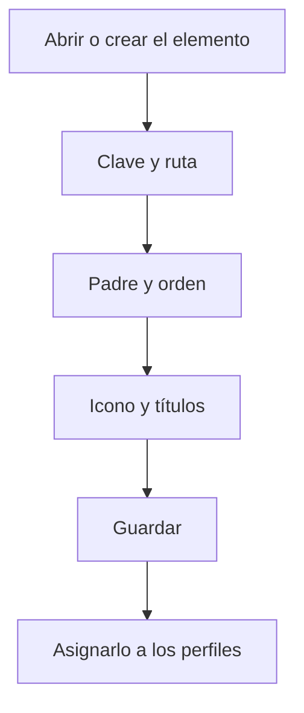

# Elemento de menú

## Para qué sirve esta pantalla

Es la ficha de un elemento del menú lateral: puede ser un grupo que agrupa otras opciones o una opción que abre una pantalla. Aquí se definen la clave, la pantalla que abre, la posición dentro del menú, el icono y el título en cada idioma activo. Para que alguien lo vea, después hay que asignarlo a un perfil en «Perfiles». La pantalla está reservada a los administradores.

## Acciones disponibles

- Rellenar la «Clave», la «Ruta», el «Orden» y el «Padre» del elemento.
- Elegir el icono con el selector del campo «Icono».
- Escribir el título en cada idioma activo en los campos «Título (...)», uno por idioma.
- Guardar con «Guardar», en la cabecera.

## Flujo habitual

1. Desde «Elementos de menú», abre el elemento o crea uno nuevo.
2. Escribe una «Clave» única que identifique el elemento.
3. Si debe abrir una pantalla, escribe su «Ruta», por ejemplo `/users`. Si es un grupo, déjala vacía.
4. Elige el «Padre», es decir, el grupo donde debe ir, y el «Orden» dentro de ese grupo.
5. Elige el «Icono» y escribe el título en todos los idiomas.
6. Pulsa «Guardar» y asigna el elemento a los perfiles en «Perfiles».

## Aspectos importantes

- La «Clave» es obligatoria y no se puede repetir en ningún otro elemento.
- Hace falta un título para cada idioma activo. Si no se han podido cargar los idiomas, aparece el aviso «No se han podido cargar los idiomas activos» y no se puede guardar.
- Cada usuario ve el título en su idioma.
- El «Orden» es obligatorio, no puede ser negativo y marca la posición dentro del grupo, de menor a mayor.
- Si no eliges ningún «Padre», el elemento aparece en el primer nivel del menú. En la lista de padres, cada nivel se marca con «>».
- Como «Padre» no se puede elegir el mismo elemento ni ningún elemento que dependa de él.
- Los cambios se ven en el menú lateral al recargar la página, y solo para los usuarios con un perfil que tenga el elemento asignado.

## Errores frecuentes

- Si al guardar aparece que la clave del elemento de menú ya existe, cambia la «Clave» por una que no use ningún otro elemento.
- Si aparece «El título es obligatorio» o «Se debe informar un título para cada uno de los idiomas activos», rellena todos los campos «Título (...)».
- Si al volver a abrir el elemento los cambios no se han guardado, comprueba primero que la «Clave» no la use ningún otro elemento y que el «Padre» no sea un elemento que dependa de este.
- Si el elemento no aparece en el menú, comprueba que esté asignado al perfil del usuario en «Perfiles» y recarga la página.

## Proceso básico

