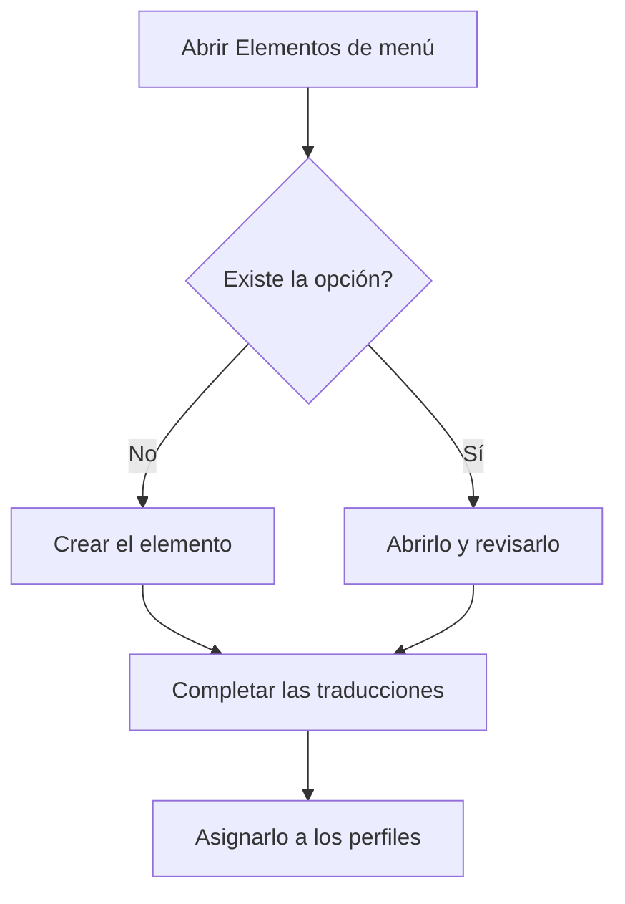

# Elementos de menú

## Para qué sirve esta pantalla

Aquí se define el menú lateral de la aplicación: los grupos, las opciones de cada grupo, su orden, el icono, la pantalla que abren y el título en cada idioma. Los elementos que se crean aquí no los ve nadie hasta que se asignan a un perfil en «Perfiles». La pantalla está reservada a los administradores.

## Acciones disponibles

- Consultar los elementos en forma de árbol, con las columnas «Título», «Clave», «Ruta», «Orden» e «Icono». La flecha de cada grupo muestra u oculta sus hijos.
- Buscar con el campo «Buscar», que filtra por el título y por la clave y mantiene visibles los grupos que contienen un resultado. El botón «Limpiar filtros» borra la búsqueda.
- Crear un elemento con el botón verde «+» (indicación «Crear nuevo»).
- Abrir un elemento haciendo clic en su fila o con el botón del lápiz de la columna «Acciones».
- Eliminar un elemento con el botón de la papelera. La aplicación pide confirmación: «¿Eliminar elemento de menú?».
- Traducir los títulos de todos los elementos a la vez con el botón «Traducir menús».
- Exportar todos los elementos a un archivo JSON con «Exportar menús», y cargar uno con «Importar menús».

## Flujo habitual

1. Busca si la opción que necesitas ya existe.
2. Si no, pulsa «+» y crea el elemento dentro del grupo que corresponda.
3. Revisa en el árbol que aparezca en el lugar y en el orden correctos.
4. Si hace falta, completa las traducciones con «Traducir menús».
5. Asigna el elemento a los perfiles que deben verlo en «Perfiles».

## Aspectos importantes

- El orden dentro de cada grupo lo marca la columna «Orden», de menor a mayor.
- Un elemento que tiene hijos no se puede eliminar: primero hay que eliminar los hijos o moverlos a otro padre.
- La eliminación es definitiva y quita el elemento de todos los perfiles que lo tenían.
- En «Traducir menús» se ve una fila por elemento y una columna por idioma activo. «Guardar» solo se activa cuando hay cambios y ningún título modificado ha quedado vacío. Si pulsas «Cancelar» con cambios pendientes, la aplicación pregunta si quieres descartarlos.
- La exportación genera un archivo con todos los elementos, sus padres, iconos, rutas, orden y títulos. Sirve, por ejemplo, para copiar el menú a otra instalación.
- Al importar, los elementos se relacionan por la «Clave»: las claves nuevas se crean y las existentes se actualizan. Los elementos que no aparecen en el archivo no se borran, y la asignación a los perfiles no cambia.
- La importación es de todo o nada: si hay algún error en el archivo, no se aplica ningún cambio. El archivo puede ocupar 5 MB como máximo.
- Al importar, tu menú lateral se actualiza solo. Los demás cambios se ven en el menú al recargar la página.

## Errores frecuentes

- Si después de eliminar un elemento sigue apareciendo en el árbol, comprueba primero si tiene elementos hijos.
- Si la exportación falla porque las traducciones de un elemento no coinciden con los idiomas activos, completa sus títulos con «Traducir menús» y vuelve a intentarlo.
- Si la importación dice que el archivo no contiene un documento JSON válido, usa un archivo generado con «Exportar menús».
- Si la importación dice que un elemento tiene una clave padre inexistente, añade el padre al mismo archivo o quítale el padre.
- Si la importación dice que las traducciones no coinciden con los idiomas activos, comprueba que cada elemento tenga un título para cada idioma activo.

## Proceso básico

