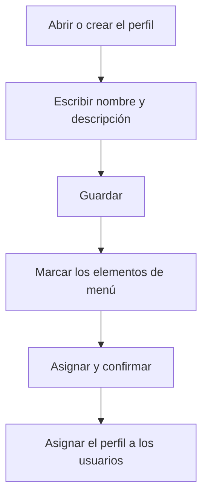

# Perfil

## Para qué sirve esta pantalla

Es la ficha de un perfil. Arriba están el nombre y la descripción del perfil; debajo, la lista de todos los elementos de menú de la aplicación, donde se marcan los que deben ver los usuarios con este perfil. Los elementos de menú se definen en «Elementos de menú» y el perfil se asigna a cada usuario en «Gestión de usuarios». La pantalla está reservada a los administradores.

## Acciones disponibles

- Escribir o cambiar el «Nombre» (obligatorio) y la «Descripción» del perfil y guardarlos con «Guardar», en la cabecera.
- Buscar elementos de menú con el campo «Buscar», que filtra por el título y por la clave.
- Marcar o desmarcar elementos de menú con la casilla de cada fila, o todos a la vez con la casilla de la cabecera de la lista.
- Guardar la selección de menús con «Asignar». La aplicación pide confirmación: «¿Confirmas guardar la selección de menús?».

## Flujo habitual

1. Desde «Perfiles», abre el perfil o crea uno nuevo.
2. Si es nuevo, escribe el «Nombre» y la «Descripción» y pulsa «Guardar».
3. En la lista de menús, marca los grupos y las opciones que debe ver este perfil. Usa «Buscar» para encontrarlos más rápido.
4. Pulsa «Asignar» y confirma.
5. Asigna el perfil a los usuarios en «Gestión de usuarios».

## Aspectos importantes

- La lista muestra los elementos de menú en forma de árbol: cada nivel aparece con más sangría. Las columnas son «Título», «Clave», «Ruta» y «Orden».
- Al marcar un elemento también se marcan todos sus hijos y todos los elementos superiores. Al desmarcarlo, se desmarcan sus hijos y los elementos superiores que ya no tengan ningún hijo marcado.
- La selección de menús no se guarda con «Guardar»: hay que pulsar «Asignar». Y «Asignar» no guarda el nombre ni la descripción.
- Primero hay que guardar el perfil y después asignarle los menús.
- Si el perfil que modificas es el tuyo, el menú lateral se actualiza al guardar la selección. Los demás usuarios con este perfil ven el cambio cuando recargan la página o vuelven a iniciar sesión.
- Si el perfil es de sistema, el «Nombre» y la casilla «Sistema» no se pueden modificar.
- La casilla «Sistema» no se guarda desde esta pantalla: marcarla no convierte el perfil en perfil de sistema.
- Los elementos de menú nuevos no se añaden solos a ningún perfil: hay que marcarlos aquí.

## Errores frecuentes

- Si «Asignar» muestra «Error» en un perfil nuevo, comprueba primero que el perfil esté guardado: vuelve a «Perfiles», ábrelo desde la lista y vuelve a asignar los menús.
- Si al guardar un perfil nuevo aparece «Error», vuelve a «Perfiles» y comprueba si el perfil ya está antes de volver a crearlo.
- Si aparece un aviso de nombre de perfil existente, elige un nombre que no tenga ningún otro perfil.
- Si un usuario no ve una opción que debería ver, comprueba que el elemento esté marcado en su perfil y que el usuario tenga ese perfil asignado.

## Proceso básico

