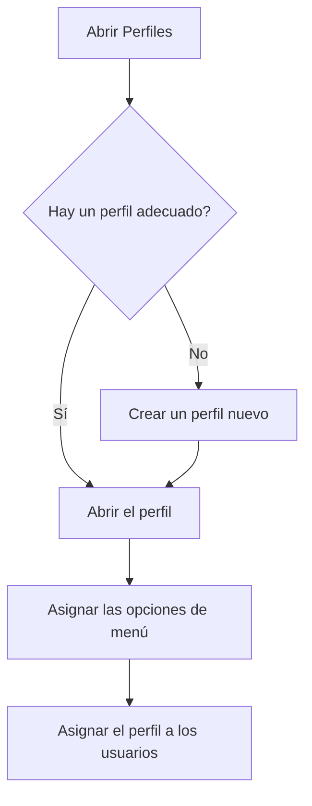

# Perfiles

## Para qué sirve esta pantalla

Un perfil es el conjunto de opciones de menú que ve un grupo de usuarios, por ejemplo «Oficina» o «Planta». Aquí se consultan, se crean y se eliminan los perfiles; las opciones de cada perfil se asignan en su ficha. Después, en «Gestión de usuarios», se asigna un perfil a cada usuario. La pantalla está reservada a los administradores.

## Acciones disponibles

- Consultar los perfiles con las columnas «Nombre», «Descripción» y «Sistema». La columna «Nombre» se puede ordenar.
- Crear un perfil nuevo con el botón verde «+» (indicación «Crear nuevo»).
- Abrir un perfil haciendo clic en su fila, para cambiar sus datos o los menús asignados.
- Eliminar un perfil con el botón de eliminar de su fila. La aplicación pide confirmación: «¿Eliminar perfil?».

## Flujo habitual

1. Revisa la lista para ver si ya existe un perfil que te sirva.
2. Si no hay ninguno, pulsa el botón «+», escribe el nombre y la descripción y guárdalo.
3. Abre el perfil y marca las opciones de menú que debe ver.
4. Ve a «Gestión de usuarios» y asigna el perfil a los usuarios que corresponda.

## Aspectos importantes

- Los perfiles marcados en la columna «Sistema» no se pueden eliminar: su fila no tiene el botón de eliminar.
- Al eliminar un perfil, se borra definitivamente junto con su asignación de menús.
- El nombre del perfil no se puede repetir.
- El perfil solo decide qué opciones aparecen en el menú lateral. Un usuario sin perfil no ve ninguna opción en el menú.

## Errores frecuentes

- Si no puedes eliminar un perfil, comprueba primero que no sea de sistema y que ningún usuario lo tenga asignado. Cambia antes el perfil de esos usuarios en «Gestión de usuarios».
- Si al crear un perfil aparece un aviso de nombre existente, elige un nombre que no tenga ningún otro perfil.

## Proceso básico

