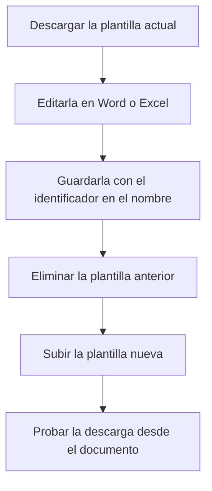

# Gestor de informes

## Para qué sirve esta pantalla

Aquí se guardan las plantillas de Word y de Excel con las que la aplicación genera los documentos descargables: presupuestos, pedidos de venta, albaranes, facturas de venta, pedidos de compra y órdenes de fabricación. Cuando en uno de estos documentos eliges la opción de descarga en Word o Excel, la aplicación busca aquí la plantilla que corresponde al documento y la rellena con sus datos. Los PDF no usan estas plantillas.

## Acciones disponibles

- Subir una plantilla con el botón de la flecha hacia arriba, a la derecha de la barra «Informes».
- Descargar una plantilla con el botón de descarga de su tarjeta, para revisarla o modificarla.
- Eliminar una plantilla con el botón de la cruz de su tarjeta. La aplicación pide confirmación: «¿Seguro que quieres eliminar el archivo seleccionado?».
- Ver una imagen o un PDF con el botón del ojo. Las plantillas de Word y de Excel no tienen vista previa: solo se pueden descargar o eliminar.

## Flujo habitual

1. Descarga la plantilla actual del documento que quieres cambiar, por ejemplo la de la factura de venta.
2. Haz los cambios en Word o en Excel y guárdala con un nombre que contenga el identificador del documento, por ejemplo `SalesInvoice.docx`.
3. Elimina la plantilla anterior de ese documento.
4. Sube la plantilla nueva con el botón de la flecha hacia arriba.
5. Abre una factura de venta, elige «Descargar» y comprueba que el documento sale con el formato nuevo.

## Aspectos importantes

- La aplicación reconoce cada plantilla por el nombre del archivo. El nombre debe contener uno de estos identificadores, escrito exactamente así (mayúsculas y minúsculas incluidas):
  - `Budget`: presupuesto, opción «Descargar».
  - `SalesOrder`: pedido de venta, opciones «Descargar» y «Descargar sin precio».
  - `DeliveryNote`: albarán, opciones «Descargar» y «Descargar sin precio».
  - `SalesInvoice`: factura de venta, opción «Descargar», y el botón de descarga de «Contabilización de facturas de venta».
  - `PurchaseOrder`: pedido de compra, opción «Descargar».
  - `WorkOrder`: orden de fabricación, opción «Descargar Excel».
- Los documentos de venta y de compra se descargan en formato Word; la orden de fabricación, en formato Excel.
- Si hay más de un archivo con el mismo identificador, la aplicación usa solo uno. Deja una sola plantilla por documento.
- Eliminar una plantilla la borra definitivamente. A partir de ese momento, la descarga en Word o Excel de ese documento deja de funcionar hasta que subas otra.
- Las opciones «Imprimir PDF» y «Descargar PDF» no dependen de esta pantalla. El logotipo, los colores y la marca de agua de los PDF se configuran en «Branding».
- En la tarjeta solo se ven los primeros 20 caracteres del nombre del archivo.

## Errores frecuentes

- Si al elegir «Descargar» en un documento no se descarga nada o sale un error, comprueba primero que aquí haya una plantilla con el identificador de ese documento en el nombre, escrito con las mismas mayúsculas.
- Si el documento sale con un formato antiguo, comprueba que no haya dos plantillas con el mismo identificador y elimina la que sobra.
- Si sale «Error al cargar el archivo» al subir una plantilla, vuelve a intentarlo y comprueba que el archivo no esté vacío.
- Si sale «Error al eliminar el archivo», vuelve a abrir la pantalla y comprueba si la plantilla sigue ahí antes de volver a intentarlo.

## Proceso básico

