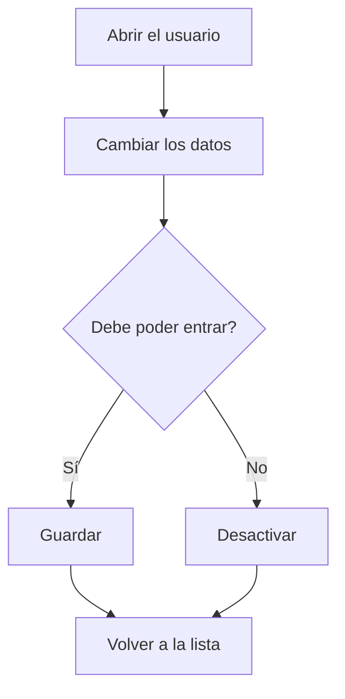

# Usuario

## Para qué sirve esta pantalla

Es la ficha de un usuario. Aquí se cambian el rol, el perfil, el nombre, los apellidos y el idioma, y se activa o se desactiva el acceso del usuario a la aplicación. Desde tu propia ficha también puedes cambiar tu contraseña. La pantalla está reservada a los administradores.

## Acciones disponibles

- Cambiar el «Rol», el «Perfil», el «Nombre», los «Apellidos» y el «Idioma» y guardarlo con «Guardar», en la cabecera.
- Desactivar el usuario con «Desactivar», en el desplegable del botón «Guardar», para que no pueda iniciar sesión. Si ya está desactivado, la opción es «Activar».
- Cambiar tu contraseña con «Cambiar contraseña», en el mismo desplegable. Solo aparece en la ficha del usuario con el que has iniciado sesión.

## Flujo habitual

1. Abre el usuario desde «Gestión de usuarios».
2. Cambia los datos que haga falta, por ejemplo el «Perfil».
3. Pulsa «Guardar». La aplicación guarda los cambios y vuelve a la pantalla anterior.
4. Si el usuario ya no debe entrar, abre el desplegable de «Guardar» y elige «Desactivar».

## Aspectos importantes

- El «Nombre de usuario» no se puede modificar.
- «Nombre» y «Apellidos» son obligatorios, de 250 caracteres como máximo.
- «Activar» y «Desactivar» guardan a la vez el resto de cambios del formulario, y solo se aplican si el formulario es correcto.
- Un usuario desactivado no puede iniciar sesión. Los usuarios no se eliminan: se desactivan.
- El «Perfil» decide qué opciones ve el usuario en el menú lateral. El campo solo aparece si hay perfiles creados en «Perfiles».
- Si cambias el «Idioma» en tu propia ficha, la aplicación cambia de idioma al instante. Para otro usuario, el nuevo idioma se aplica cuando vuelve a iniciar sesión.
- Los cambios de perfil se ven cuando el usuario recarga la página o vuelve a iniciar sesión; los de rol, cuando vuelve a iniciar sesión.
- Para cambiar la contraseña hay que escribir la «Contraseña actual», la nueva «Contraseña» (al menos 5 caracteres) y repetirla. Se confirma con «Modificar».
- No se puede cambiar la contraseña de otro usuario desde esta pantalla.

## Errores frecuentes

- Si al cambiar la contraseña aparece «Error al actualizar la contraseña», comprueba primero que la «Contraseña actual» sea correcta.
- Si «Modificar» no hace nada, revisa los avisos de los campos: la contraseña nueva debe tener al menos 5 caracteres y las dos deben coincidir.
- Si el usuario dice que no puede entrar, comprueba que no esté desactivado (en la lista, columna «Desactivado»).
- Si el usuario no ve las opciones esperadas en el menú, comprueba su «Perfil» y los menús asignados a ese perfil en «Perfiles».

## Proceso básico

