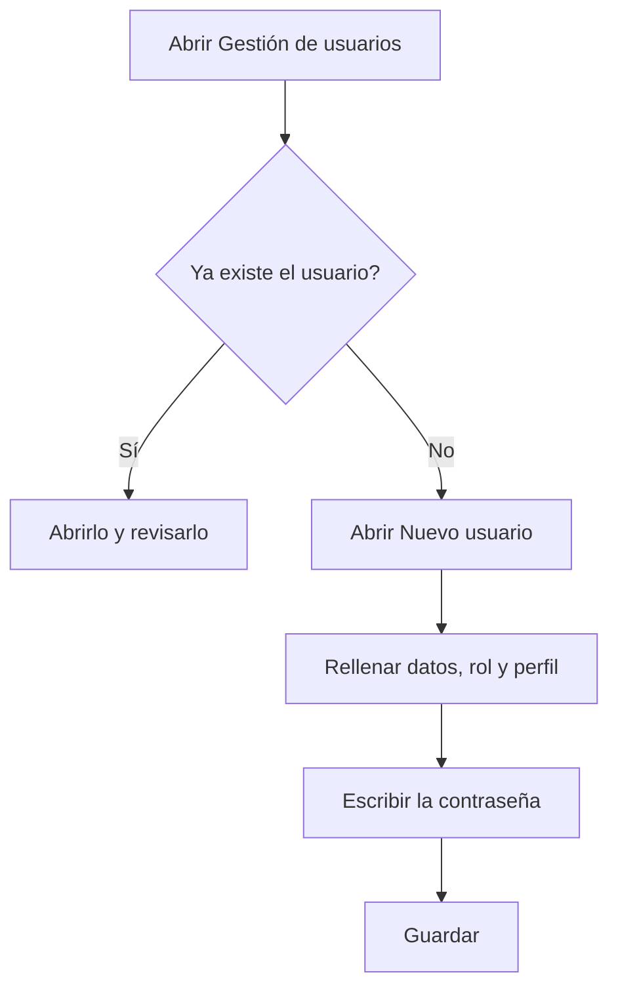

# Gestión de usuarios

## Para qué sirve esta pantalla

Aquí se consultan los usuarios que pueden entrar en la aplicación y se crean usuarios nuevos. Cada usuario tiene un rol, un idioma y, normalmente, un perfil, que decide qué opciones ve en el menú lateral. Los perfiles se preparan en «Perfiles». La pantalla está reservada a los administradores.

## Acciones disponibles

- Consultar los usuarios con las columnas «Nombre de usuario», «Nombre», «Apellidos», «Perfil» y «Desactivado». Todas las columnas se pueden ordenar.
- Crear un usuario con el botón verde «+» (indicación «Crear nuevo»), que abre el diálogo «Nuevo usuario».
- Abrir un usuario haciendo clic en su fila, para cambiar sus datos o su perfil, o para activarlo o desactivarlo.

## Flujo habitual

1. Comprueba en la lista que el usuario no exista ya.
2. Pulsa el botón «+» para abrir «Nuevo usuario».
3. Rellena «Nombre de usuario», «Nombre», «Apellidos», «Correo electrónico», «Rol» e «Idioma».
4. Elige el «Perfil» con las opciones de menú que debe ver.
5. Escribe la «Contraseña» y repítela en «Repetir contraseña».
6. Pulsa «Guardar». El usuario aparece en la lista y ya puede iniciar sesión.

## Aspectos importantes

- Son obligatorios el nombre de usuario, el nombre, los apellidos, el correo electrónico, el rol, el idioma y la contraseña. La contraseña debe tener al menos 5 caracteres.
- El nombre de usuario no se puede repetir y, una vez creado el usuario, ya no se puede cambiar.
- El «Perfil» es opcional al crear el usuario, pero un usuario sin perfil no ve ninguna opción en el menú lateral.
- El usuario se crea activo. La columna «Desactivado» indica los usuarios que no pueden iniciar sesión.
- Los usuarios no se eliminan: si alguien ya no debe entrar, ábrelo y desactívalo.
- El «Idioma» es el que la aplicación usa para el usuario cuando inicia sesión.

## Errores frecuentes

- Si al guardar aparece que el nombre de usuario no está disponible, ya existe un usuario con ese nombre: elige otro o abre el existente.
- Si aparece «Las contraseñas no coinciden», escribe exactamente la misma contraseña en los dos campos.
- Si aparece «El formato del correo electrónico no es válido», revisa que la dirección tenga el formato nombre@dominio.
- Si un usuario nuevo entra pero no ve ninguna opción en el menú, ábrelo y asígnale un perfil que tenga menús asignados.

## Proceso básico

