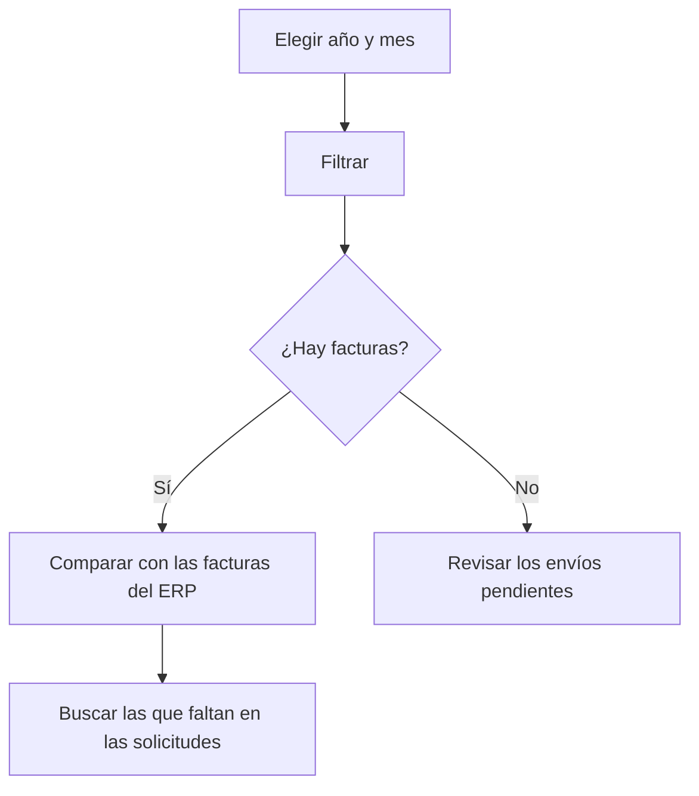

# Verifactu - Consulta de facturas enviadas

## Para qué sirve esta pantalla

Consulta directamente a la AEAT qué facturas constan registradas en Verifactu en un mes concreto. No muestra los datos del ERP, sino lo que la AEAT tiene guardado. Sirve para contrastar los envíos hechos desde «Integración de Facturas en Verifactu» y «Solicitudes de integración Verifactu» con lo que realmente consta en la Agencia Tributaria.

## Acciones disponibles

- Elegir el «Año» (desde 2024 hasta el año actual) y el «Mes».
- Hacer la consulta con el botón «Filtrar» (icono del embudo).
- Borrar el filtro y vaciar la lista con «Limpiar».
- Ordenar por cualquier columna haciendo clic en la cabecera.
- Ver la huella completa pasando el ratón por encima de la columna «Huella».

## Flujo habitual

1. Abre la pantalla: el filtro propone el mes actual o el último mes que consultaste.
2. Elige el «Año» y el «Mes» que quieres revisar.
3. Pulsa «Filtrar» y espera la respuesta de la AEAT.
4. Revisa la lista: número, fecha de expedición, tipo, importes, fecha de registro y huella.
5. Compárala con las facturas del mes en el ERP y, si falta alguna, búscala en «Solicitudes de integración Verifactu».

## Aspectos importantes

- La consulta no se hace sola al abrir la pantalla: hay que pulsar «Filtrar».
- La consulta se hace con el «CIF» del centro activo (pantalla «Gestión de centros») y el nombre de la empresa activa (pantalla «Gestión de empresas»).
- Se buscan las facturas con fecha de expedición dentro del mes elegido.
- La columna «Tipo» muestra el código de la AEAT: las facturas ordinarias se envían como «F1» y las rectificativas como «R1».
- La «Fecha de registro» es la fecha y hora en que el ERP generó el registro enviado.
- El último año y mes consultados se guardan como filtro para la próxima vez.
- Esta pantalla solo consulta: no envía, no corrige ni anula nada.

## Errores frecuentes

- Si aparece «Filtro incompleto», elige el año y el mes antes de pulsar «Filtrar».
- Si aparece «Sin resultados», la AEAT no tiene ninguna factura registrada para ese mes con el CIF del centro. Comprueba que las facturas se hayan enviado desde «Integración de Facturas en Verifactu» y que el «CIF» del centro sea correcto.
- Si aparece «Error en la búsqueda de facturas», la consulta a la AEAT ha fallado. Vuelve a intentarlo más tarde y, si persiste, avisa al administrador para que revise la conexión y el certificado de Verifactu.
- Si una factura enviada no aparece, búscala en «Solicitudes de integración Verifactu»: si la solicitud tiene «Error», la AEAT no la ha registrado y hay que corregirla y reenviarla.

## Proceso básico

