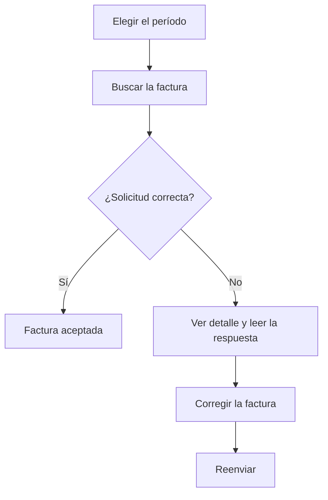

# Solicitudes de integración Verifactu

## Para qué sirve esta pantalla

Es el historial de todos los envíos de facturas de venta a Verifactu. Cada vez que se envía una factura, correcta o no, queda una solicitud con lo que se ha enviado a la AEAT, lo que ha respondido y el código QR. Sirve para comprobar si una factura consta como aceptada, entender por qué se ha rechazado y reenviarla una vez corregida. Los envíos se hacen desde «Integración de Facturas en Verifactu».

## Acciones disponibles

- Elegir el «Período» para ver las solicitudes hechas entre dos fechas. La lista se recarga sola cuando las dos fechas son válidas.
- Filtrar por número de factura o por cliente con «Buscar».
- Copiar la «Petición» o la «Respuesta» completas con el botón de copiar de cada celda.
- Abrir la página de validación de la AEAT haciendo clic en la imagen del «QR».
- Ver la petición y la respuesta completas con «Ver detalle» (icono del ojo).
- Reenviar una factura rechazada con «Reenviar» (icono de refresco), que solo aparece en las filas con error.
- Restablecer los filtros con «Limpiar».

## Flujo habitual

1. Abre la pantalla: aparecen las solicitudes de los últimos siete días.
2. Busca la factura por su número o por el cliente.
3. Mira la columna «Éxito»: «Correcto» significa que la AEAT la ha aceptado; «Error», que la ha rechazado.
4. Si hay un error, abre «Ver detalle» y lee la «Respuesta» para saber el motivo.
5. Corrige la factura (por ejemplo, los datos fiscales del cliente).
6. Vuelve aquí, pulsa «Reenviar» en la fila con error y confírmalo con «Aceptar».

## Aspectos importantes

- Una factura puede tener varias solicitudes: una por cada intento. Aparecen todas las solicitudes de las facturas que tienen al menos una dentro del período, aunque algún intento sea anterior.
- La columna «Estado» muestra el estado que ha devuelto la AEAT: «Correcto», «AceptadoConErrores» o «Incorrecto». Los dos primeros se consideran correctos.
- «Reenviar» hace un envío nuevo y añade una solicitud nueva; no modifica las anteriores. La factura pasa al estado de Verifactu «OK» o «Error» según la respuesta.
- Una factura que ya tiene alguna solicitud correcta no se puede reenviar, aunque el botón aparezca en una fila de error antigua de esa factura.
- El reenvío se encadena con el último registro aceptado, igual que un envío normal desde «Integración de Facturas en Verifactu».
- Esta pantalla no borra ni anula nada: solo consulta y reenvía.
- El documento de la factura imprime el QR de la última solicitud correcta.

## Errores frecuentes

- Si al reenviar aparece «La factura ya ha sido integrada con Verifactu», la factura ya tiene una solicitud correcta: búscala en la lista, no hace falta hacer nada más.
- Si la «Respuesta» indica un error en el NIF o el nombre del cliente, corrígelos en la pestaña «Datos fiscales» de la factura (solo aparece mientras el estado de Verifactu es «Pendent» o «Error») y después reenvía.
- Si el reenvío vuelve a fallar con el mismo motivo, lee el código y la descripción del mensaje de error: vienen directamente de la AEAT e indican qué dato hay que corregir.
- Si no ves las solicitudes del último día del período, amplía la fecha final un día más.
- Si la lista no se carga, comprueba que las dos fechas del «Período» estén elegidas y que la inicial no sea posterior a la final.
- Si la factura tiene respuesta «AceptadoConErrores», consta como aceptada: revisa la «Respuesta» para ver los avisos de la AEAT.

## Proceso básico

