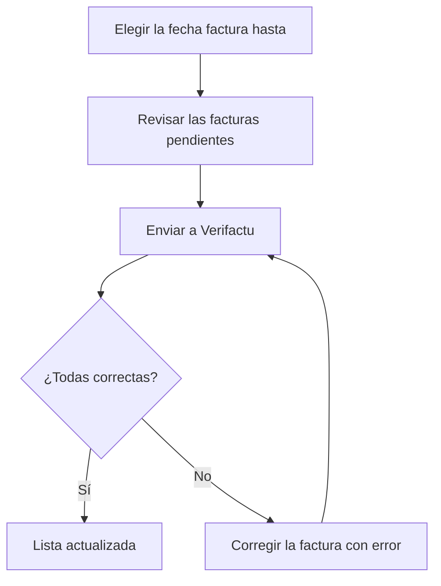

# Integración de Facturas en Verifactu

## Para qué sirve esta pantalla

Desde aquí se envían a la Agencia Tributaria (AEAT), a través de Verifactu, las facturas de venta que todavía no constan allí. Es el último paso del circuito de venta: `pedido -> albarán -> factura -> envío a Verifactu`. El envío no es automático: las facturas no llegan a Verifactu hasta que alguien las envía desde aquí o las reenvía desde «Solicitudes de integración Verifactu».

## Acciones disponibles

- Elegir la «Fecha factura hasta» para ver las facturas pendientes con fecha de factura hasta ese día incluido. La lista se recarga sola al cambiar la fecha.
- Restablecer el filtro con «Limpiar»: la fecha vuelve a ser la de hoy.
- Enviar todas las facturas de la lista con «Enviar a Verifactu». El número del botón indica cuántas facturas se enviarán.
- Abrir la ficha de una factura haciendo clic en su número.
- En el diálogo de resultado, desplegar la respuesta de la AEAT de una factura con error con «Mostrar detalles».

## Flujo habitual

1. Abre la pantalla: aparecen las facturas pendientes hasta hoy.
2. Si solo quieres enviar hasta una fecha concreta, cambia la «Fecha factura hasta».
3. Revisa la lista (número, fecha, vencimiento, cliente con su NIF e importe).
4. Pulsa «Enviar a Verifactu» y espera a que termine la barra de progreso. Mientras se envía, el diálogo no se puede cerrar.
5. Revisa el resumen de «correctas» y «errores» y cierra el diálogo con «Cerrar». La lista se recarga y las facturas aceptadas desaparecen.
6. Si alguna factura ha fallado, corrígela (consulta los errores más abajo) y vuelve a enviarla.

## Aspectos importantes

- La lista muestra las facturas con el estado de Verifactu inicial (normalmente «Pendent») o «Error». Por eso las facturas rechazadas vuelven a aparecer para reintentarlas.
- Las facturas reciben el estado inicial del ciclo de vida «Verifactu» al crearse, también las rectificativas. Las facturas sin estado de Verifactu nunca aparecen en esta lista.
- Las facturas se envían una a una por orden de número. Cada registro se encadena con el último registro aceptado por la AEAT y lleva una huella (hash) calculada a partir del anterior; el primer registro de todos se marca como inicio de la cadena.
- El envío se detiene en la primera factura que falla, para mantener la cadena en orden. Las facturas posteriores quedan pendientes y siguen en la lista.
- Una factura se considera aceptada cuando la AEAT responde «Correcto» o «AceptadoConErrores». En ese caso el estado de Verifactu de la factura pasa a «OK»; si responde con cualquier otro estado, pasa a «Error».
- Cada intento, correcto o no, queda registrado con la petición enviada, la respuesta y el código QR. Se consulta en «Solicitudes de integración Verifactu».
- Las facturas rectificativas se envían como rectificativas y hacen referencia a la factura original.
- Cuando una factura ya está aceptada, no se puede volver a enviar y sus datos fiscales de cliente quedan bloqueados. El documento de la factura imprime el QR del último envío aceptado.
- Como emisor se envían el «CIF» del centro de la factura y el nombre de la empresa (pantallas «Gestión de centros» y «Gestión de empresas»).

## Errores frecuentes

- Si el resultado muestra «Incorrecto» y un mensaje con un código y una descripción, es un rechazo de la AEAT. Lee la descripción y, si hace falta, abre «Mostrar detalles» para ver la respuesta completa.
- Si el rechazo se debe a los datos del cliente (NIF o razón social), abre la factura y corrígelos en la pestaña «Datos fiscales», que solo aparece mientras el estado de Verifactu es «Pendent» o «Error». Al guardar puedes aplicar la corrección a las demás facturas pendientes o con error del mismo cliente; la ficha del cliente también se actualiza. Después vuelve a enviar.
- Si aparece «La factura no tiene detalles. No se puede enviar a Verifactu», añade líneas a la factura antes de enviarla.
- Si aparece «No se ha encontrado la empresa para enviar la factura a Verifactu», comprueba que haya una empresa activa en «Gestión de empresas».
- Si aparece «La factura ya ha sido integrada con Verifactu», la factura ya consta como aceptada: compruébalo en «Solicitudes de integración Verifactu» y no la vuelvas a enviar.
- Si el envío se detiene por un error de tiempo de espera o un error inesperado, antes de reintentar revisa «Solicitudes de integración Verifactu»: la petición puede haber llegado igualmente a la AEAT. Si el error se repite con todas las facturas, avisa al administrador para que revise la conexión y el certificado de Verifactu.
- Si la lista sale siempre vacía, comprueba en «Ciclos de vida» que exista el ciclo «Verifactu» con un estado inicial.
- Si una factura con respuesta «AceptadoConErrores» se ha dado por buena, revisa su respuesta en «Solicitudes de integración Verifactu» para ver los avisos de la AEAT.

## Proceso básico

