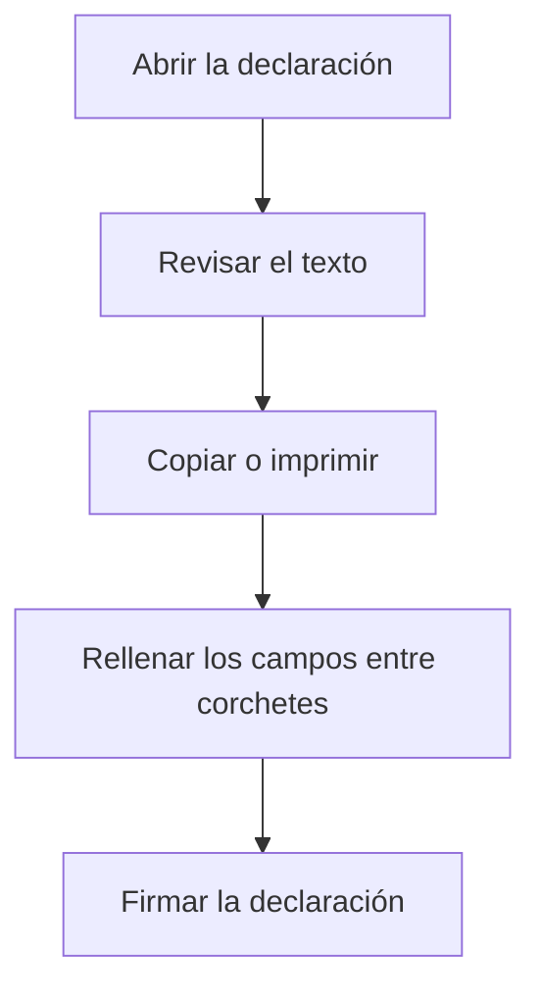

# Declaración responsable de implementación del sistema Veri\*Factu

## Para qué sirve esta pantalla

Muestra el modelo de texto de la declaración responsable sobre el sistema de facturación y Veri\*Factu. Es un documento de consulta: no se configura nada, no se guarda nada y no se envía nada a la AEAT. Sirve como base para redactar la declaración que debe firmar la empresa responsable del software.

## Acciones disponibles

- Leer el texto de la declaración.
- Imprimirla desde el navegador (por ejemplo, con Ctrl+P): la pantalla tiene un formato pensado para la impresión.

## Flujo habitual

1. Abre la pantalla.
2. Lee el texto e identifica los campos entre corchetes, por ejemplo [RAZÓN SOCIAL], [CIF] o [Nombre del software].
3. Copia el texto al documento donde lo quieras completar.
4. Rellena los campos entre corchetes con los datos reales y haz que lo firme la persona responsable.

## Aspectos importantes

- Los campos entre corchetes son marcadores: la aplicación no los rellena con los datos de la empresa ni del centro.
- El texto es fijo y aparece en el idioma de la aplicación. No se puede editar desde aquí.
- La declaración enumera compromisos del software (integridad de los registros, huella y encadenamiento, envío a la AEAT, conservación e identificación única). La pantalla solo los muestra; no hace ninguna comprobación.
- Los envíos reales a Verifactu se hacen en «Integración de Facturas en Verifactu» y se consultan en «Solicitudes de integración Verifactu».

## Errores frecuentes

- Si el documento impreso sale con [ciudad], [fecha] o [CIF] literales, es que no se han rellenado: la pantalla no sustituye esos campos. Complétalos en el documento que vas a firmar.
- Si no encuentras esta pantalla en el menú, puede que no esté añadida: un administrador puede añadirla al menú.
- Si necesitas el texto en otro idioma, cambia el idioma de la aplicación y vuelve a abrir la pantalla.

## Proceso básico

