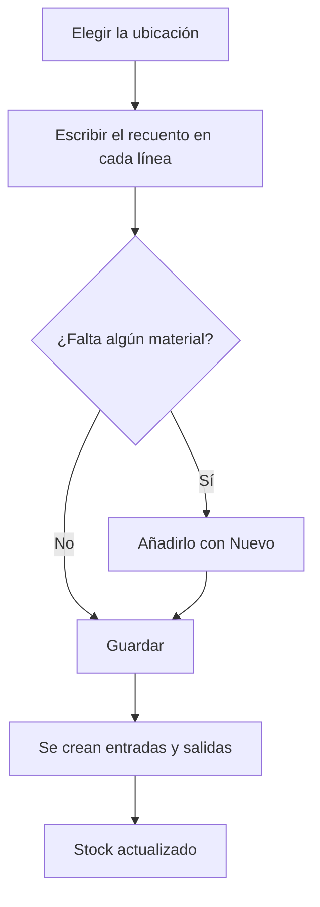

# Inventario

## Para qué sirve esta pantalla

Sirve para ajustar el stock del sistema al recuento físico. Cada línea muestra una referencia en una ubicación, con su lote y sus medidas, las unidades que hay en el sistema («Uds.») y una casilla «Recuento» donde escribes lo que has contado. Al pulsar «Guardar», el sistema crea una entrada o una salida por cada diferencia, que después se ven en «Movimientos de almacén» y actualizan «Existencias».

## Acciones disponibles

- Filtrar por «Ubicación» y buscar por «Referencia». La lista se filtra al instante.
- Quitar los filtros con «Limpiar».
- Escribir el recuento real en la columna «Recuento» de cada línea.
- Añadir una línea de stock que no aparece en la lista con el botón «Nuevo» (+): elige el «Material», la «Ubicación», el lote, la «Cantidad» y, si hace falta, las medidas.
- Aplicar todos los cambios con «Guardar».

## Flujo habitual

1. Elige la «Ubicación» que quieres contar.
2. Para cada línea, escribe lo que has contado en «Recuento». Déjala igual si coincide.
3. Si encuentras material que no aparece en la lista, añádelo con «Nuevo» (+).
4. Pulsa «Guardar».
5. Comprueba el mensaje «Inventario creado correctamente». La lista se vuelve a cargar con el stock nuevo.

## Aspectos importantes

- Hasta que no pulsas «Guardar» no se guarda nada. Si sales de la pantalla antes, pierdes los recuentos escritos.
- «Guardar» aplica los cambios de todas las líneas modificadas, también las que el filtro oculta en ese momento.
- Para cada línea modificada: si el recuento es mayor que «Uds.», se crea una «Entrada» con la descripción «Entrada per inventari»; si es menor, una «Salida» con la descripción «Sortida per inventari». Un recuento de 0 vacía la línea.
- El movimiento se hace en la misma ubicación, lote y medidas de la línea.
- Las líneas nuevas añadidas con «Nuevo» (+) aparecen con «Uds.» a 0 y se guardan como una entrada al pulsar «Guardar». Si las medidas no coinciden exactamente con las de un stock existente, se crea una línea de stock aparte.
- En el diálogo «Nuevo», el lote solo se puede elegir después del material. Puedes elegir un lote abierto o escribir un código nuevo y elegir la opción «Crear lot "..."». El lote nuevo se crea en ese momento, aunque después canceles el diálogo.
- Si el recuento deja un lote a cero en todas las ubicaciones, el lote se cierra automáticamente y ya no puede recibir más entradas.
- Solo aparecen las líneas con unidades positivas de almacenes, ubicaciones y referencias activos. Las referencias de servicio no tienen stock.

## Errores frecuentes

- Si al guardar aparece «Error al crear el movimiento de inventario» con «El lote ya está cerrado y no se puede reabrir», la línea intenta sumar unidades a un lote cerrado: usa un lote abierto o crea uno nuevo con «Nuevo» (+).
- Si al guardar aparece «No hay una ubicación por defecto definida en el proyecto», elige la «Ubicación predeterminada» del almacén activo en «Gestión de almacenes».
- Si al guardar aparece un error, vuelve a abrir la pantalla y revisa el stock antes de guardar de nuevo: las líneas que sí se han guardado ya se han aplicado y se volverían a aplicar.
- Si el diálogo «Nuevo» no se guarda, revisa los avisos: «La referencia es obligatoria», «La ubicación es obligatoria» o «La cantidad debe ser como mínimo 1».
- Si no encuentras una referencia en la lista, comprueba primero si tiene el stock a cero (añádela con «Nuevo» (+)) o si está en un almacén o una ubicación desactivados.

## Proceso básico

