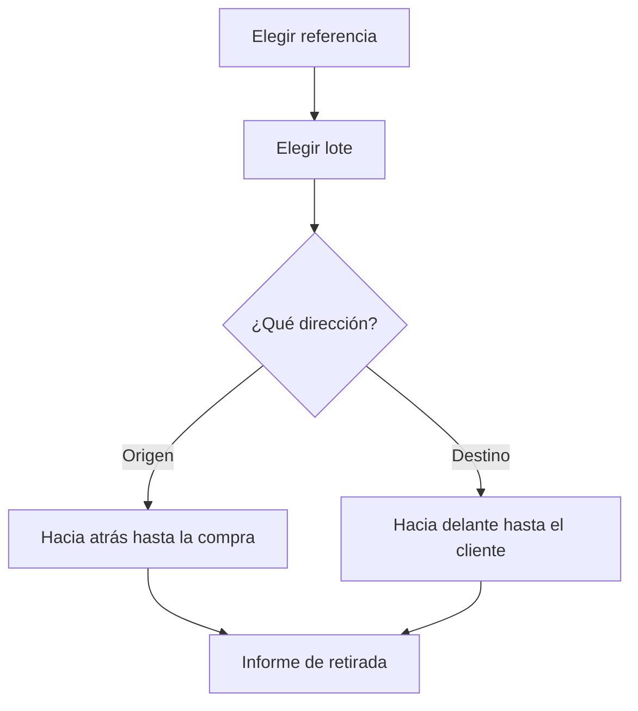

# Trazabilidad de lotes

## Para qué sirve esta pantalla

Permite seguir un lote a lo largo de la cadena `recepción de compra -> consumo en la máquina -> producción de la OF -> albarán de venta`. Eliges una referencia y un lote y ves, en forma de árbol, de qué lotes de material procede (hacia atrás) o a qué lotes producidos y clientes ha llegado (hacia delante). Ante una incidencia de calidad, el «Informe de retirada» indica qué clientes, albaranes y unidades están afectados. Es una pantalla de consulta: no modifica nada.

## Acciones disponibles

- Elegir la «Referencia» y después el «Lote». La trazabilidad se carga al elegir el lote.
- Consultar la pestaña «Hacia atrás (desde un lote vendido)»: los lotes de material consumidos para fabricar el lote, nivel a nivel, hasta los lotes que entraron por una recepción de compra.
- Consultar la pestaña «Hacia delante (desde un lote de compra)»: los lotes producidos con este material, nivel a nivel, hasta el producto final.
- Desplegar cada lote del árbol con la flecha para ver sus lotes relacionados y sus movimientos.
- Generar el «Informe de retirada» con el botón del mismo nombre. Aparece debajo de las pestañas.
- Llegar a la pantalla con la referencia y el lote ya elegidos desde el icono «Ver trazabilidad del lote» de «Existencias», de «Movimientos de almacén» o de las líneas de un albarán de recepción.

## Flujo habitual

1. Elige la «Referencia» del producto o del material afectado.
2. Elige el «Lote» en el desplegable.
3. En «Hacia atrás», despliega el árbol para ver de qué lotes de material procede y, en las filas de movimiento, el proveedor y el albarán de recepción.
4. Cambia a «Hacia delante» para ver en qué lotes producidos se ha utilizado y, en las filas de movimiento, los clientes y los albaranes de venta.
5. Pulsa «Informe de retirada» para obtener, por cliente, los albaranes afectados, con el total de albaranes y de unidades.

## Aspectos importantes

- Solo tienen lotes las referencias marcadas con «Requiere lote». Los lotes se crean solos: en la línea de un albarán de recepción, al crear la orden de fabricación (el lote producido toma el código de la OF o el código indicado al crearla, según la configuración), en un albarán de venta sin lote y en el diálogo «Nuevo» de «Inventario».
- El enlace entre un lote de material y el lote producido lo crea el consumo registrado al finalizar la fase en la máquina. Sin ese consumo, el árbol no puede bajar más.
- Hacia atrás, el árbol se detiene en los lotes que entraron por una recepción de compra. El árbol llega como máximo a 10 niveles.
- En la columna «Cantidad», la primera fila muestra lo que queda del lote; las filas de otros lotes, la cantidad consumida; y las filas de movimiento, la cantidad del movimiento, negativa en las salidas y los consumos.
- Las filas de movimiento llevan la etiqueta del tipo, la ubicación, el proveedor o el cliente y la descripción. La «Fecha» solo aparece en estas filas. Los traslados de aprovisionamiento a las máquinas no aparecen.
- El desplegable «Lote» solo ofrece lotes abiertos. Un lote se cierra solo cuando su stock llega a cero en todas las ubicaciones y no se vuelve a abrir, de modo que un lote ya consumido o vendido del todo no se puede elegir aquí.
- El «Informe de retirada» parte de la trazabilidad hacia delante: recoge los albaranes de venta de los lotes finales a los que ha llegado el lote (o del propio lote, si no se ha utilizado para fabricar nada), agrupados por cliente, con «N albaranes afectados» y «N unidades afectadas». Si el lote se ha consumido en alguna OF, el informe no cuenta las ventas directas del propio lote.

## Errores frecuentes

- Si el desplegable «Lote» aparece desactivado, elige antes la «Referencia».
- Si el lote que buscas no aparece en el desplegable, comprueba primero si ya está cerrado (stock a cero) o si la referencia no tiene «Requiere lote».
- Si llegas desde un icono de trazabilidad y el lote no queda elegido, el lote ya está cerrado.
- Si aparece el aviso «No se ha encontrado el lote», el lote ya no existe: vuelve a elegir la referencia.
- Si el árbol hacia atrás solo muestra el lote elegido, comprueba que al finalizar la fase de la OF se registrara el consumo del material y que ese material tuviera lote.
- Si el informe dice «Este lote no ha llegado a ningún cliente.», ningún albarán de venta lleva todavía este lote ni los lotes producidos a partir de él.

## Proceso básico

