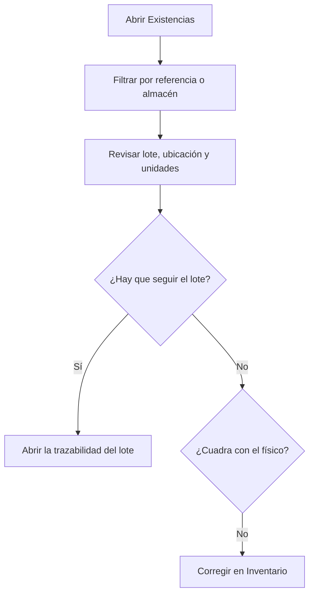

# Existencias

## Para qué sirve esta pantalla

Muestra el stock actual: cuántas unidades hay de cada referencia, en qué almacén y ubicación, de qué lote y con qué medidas. Es una pantalla de consulta: el stock solo cambia con movimientos, que generan las recepciones de compra, los albaranes de venta, el aprovisionamiento y el consumo en las máquinas, la producción de las órdenes de fabricación y «Inventario». El historial de estos movimientos está en «Movimientos de almacén».

## Acciones disponibles

- Filtrar por «Almacén» y por «Referencia». La lista se filtra al instante.
- Quitar los filtros con «Limpiar».
- Ordenar por la columna «Referencia».
- Abrir la trazabilidad del lote de una fila con el icono «Ver trazabilidad del lote». Se abre «Trazabilidad de lotes» con la referencia y el lote ya elegidos.
- Guardar la configuración de columnas y filtros en una vista, para recuperarla la próxima vez.

## Flujo habitual

1. Abre «Existencias».
2. Elige la «Referencia» que quieres consultar y, si hace falta, el «Almacén».
3. Revisa cada fila: «Lote», «Almacén», «Ubicación», «Uds.» y medidas.
4. Si tienes que seguir un lote, pulsa el icono de trazabilidad de la fila.
5. Si el stock no cuadra con el físico, corrígelo en «Inventario».

## Aspectos importantes

- Cada fila es una combinación de referencia, ubicación, lote y medidas («Ancho (x) mm», «Largo (y) mm», «Alto (z) mm», «Diámetro (mm)», «Grosor (mm)»). Una misma referencia puede aparecer en varias filas si tiene lotes, ubicaciones o medidas diferentes.
- Solo aparecen las filas con unidades positivas. Cuando una fila llega a cero, desaparece.
- No aparece el stock de almacenes, ubicaciones o referencias marcados como desactivados.
- Las referencias de servicio nunca tienen stock.
- El desplegable «Referencia» solo ofrece referencias que tienen stock.
- La etiqueta «Cerrado» junto al lote indica que el lote ya está cerrado. Un lote se cierra solo cuando su stock total llega a cero y ya no puede volver a recibir entradas.
- El icono de trazabilidad queda desactivado si la fila no tiene lote.
- Las entradas automáticas (recepciones, producción, devoluciones de albarán) van a la «Ubicación predeterminada» del almacén activo, definida en «Gestión de almacenes».

## Errores frecuentes

- Si una referencia no aparece, comprueba primero que no sea un servicio, que no tenga el stock a cero y que el almacén, la ubicación o la referencia no estén desactivados.
- Si una recepción no se ha sumado al stock, comprueba que el albarán de recepción esté en el estado «Recepcionat»: hasta entonces no genera la entrada.
- Si el stock de una referencia aparece repartido en filas que esperabas juntas, revisa su lote y sus medidas: cualquier diferencia crea una fila aparte.
- Si el icono de trazabilidad abre la pantalla sin ningún lote elegido, el lote ya está cerrado.

## Proceso básico

