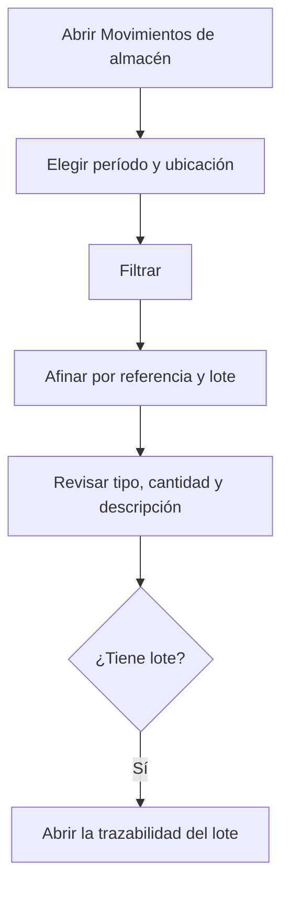

# Movimientos de almacén

## Para qué sirve esta pantalla

Es el historial de todos los movimientos de stock: entradas y salidas, aprovisionamiento y consumo en las máquinas, producción y regularizaciones de inventario. Sirve para saber por qué el stock de una referencia o de un lote es el que es. Es solo de consulta: los movimientos los generan automáticamente otras pantallas, y el stock resultante se ve en «Existencias».

## Acciones disponibles

- Elegir el «Período» y pulsar «Filtrar» para cargar los movimientos de esas fechas.
- Limitar la carga a una «Ubicación» (se aplica al pulsar «Filtrar»).
- Afinar la lista cargada por «Referencia» y por «Lote».
- Quitar los filtros con «Limpiar».
- Abrir la trazabilidad del lote de un movimiento con el icono «Ver trazabilidad del lote».
- Guardar la configuración de columnas y filtros en una vista, para recuperarla la próxima vez.

## Flujo habitual

1. Abre «Movimientos de almacén». El «Período» ya propone las fechas del ejercicio del año en curso.
2. Ajusta el período y, si hace falta, la «Ubicación», y pulsa «Filtrar».
3. Elige la «Referencia» y, si hace falta, el «Lote» para quedarte solo con los movimientos que te interesan.
4. Revisa la «Fecha», el «Tipo de movimiento», la «Cantidad» y la «Descripción», que indica de dónde viene el movimiento.
5. Si el movimiento tiene lote, abre su trazabilidad con el icono de la fila.

## Aspectos importantes

- Qué genera cada tipo de movimiento:
  - «Entrada»: una recepción de compra cuando el albarán de recepción pasa al estado «Recepcionat»; la devolución de un albarán de venta que deja de estar «Entregat»; un recuento de «Inventario» por encima del stock.
  - «Salida»: un albarán de venta cuando pasa a «Entregat»; un recuento de «Inventario» por debajo del stock.
  - «Entrada» y «Salida» en pareja: el aprovisionamiento de material a una máquina y su devolución. La descripción dice, por ejemplo, «Aprovisionamiento a APR-... OF ...».
  - «Consumo»: al finalizar una fase en la máquina, se consume el material aprovisionado. Los recortes que sobran vuelven a la ubicación predeterminada como «Consumo» positivo («Retorno recorte a ...»).
  - «Producción»: al finalizar la última fase de una orden de fabricación, entran en la ubicación predeterminada las piezas buenas de la última fase interna («Producción OF ...»).
- La «Cantidad» es positiva en las entradas y negativa en las salidas y los consumos.
- Las referencias de servicio nunca generan movimientos.
- Si un albarán de recepción deja de estar en «Recepcionat», su movimiento de entrada se borra del historial y el stock se resta. En cambio, si un albarán de venta deja de estar «Entregat», se crea un movimiento de entrada de devolución.
- La «Descripción» se guarda en el idioma del usuario que generó el movimiento.
- Los movimientos no se pueden modificar ni eliminar desde aquí. Para corregir el stock, usa «Inventario».
- Los filtros «Referencia» y «Lote» solo actúan sobre los movimientos ya cargados; el desplegable «Lote» solo ofrece los lotes que aparecen en ellos.

## Errores frecuentes

- Si aparece el aviso «Filtro inválido» con «Selecciona un período», elige las dos fechas del período antes de pulsar «Filtrar».
- Si el «Período» aparece vacío al abrir la pantalla, no existe ningún ejercicio con el nombre del año en curso: elige las fechas a mano.
- Si no encuentras un movimiento, comprueba primero que su fecha esté dentro del período y que la «Ubicación» filtrada sea la correcta; después vuelve a pulsar «Filtrar».
- Si falta la entrada de una recepción, comprueba que el albarán de recepción esté en «Recepcionat» y que la referencia no sea un servicio.
- Si el icono de trazabilidad no aparece en un movimiento, el movimiento no tiene lote o su lote no tiene código.

## Proceso básico

