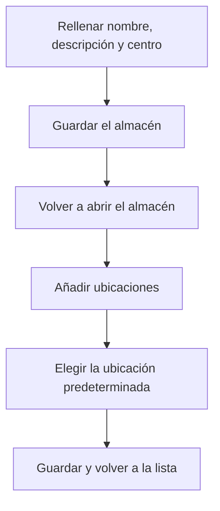

# Almacén

## Para qué sirve esta pantalla

Es la ficha de un almacén. Arriba están los datos del almacén (nombre, descripción, centro, ubicación predeterminada y si está desactivado) y debajo, la tabla «Ubicaciones», donde se crean y se mantienen las ubicaciones en las que se guarda el stock. Al crear un almacén, el título es «Alta de almacén»; al editar uno, «Almacén» seguido del nombre. La lista de todos los almacenes está en «Gestión de almacenes».

## Acciones disponibles

- Editar el «Nombre», la «Descripción», el «Centro», la «Ubicación predeterminada» y la casilla «Desactivado», y guardarlo con «Guardar», en la cabecera.
- Añadir una ubicación con el botón + de la tabla «Ubicaciones». Se abre el diálogo «Crear ubicación».
- Editar una ubicación haciendo clic en su fila (diálogo «Actualizar ubicación»).
- Eliminar una ubicación con la cruz de la fila y confirmar el mensaje «¿Seguro que quieres eliminar la ubicación...?».
- Filtrar las ubicaciones por tipo con el desplegable «Todos los tipos».

## Flujo habitual

1. Desde «Gestión de almacenes», pulsa «Nuevo» (+) para abrir «Alta de almacén».
2. Rellena el «Nombre», la «Descripción» y el «Centro» y pulsa «Guardar».
3. Vuelve a la lista y abre el almacén nuevo.
4. Pulsa + en «Ubicaciones», rellena el «Nombre», la «Descripción» y, si hace falta, la «Tipología», y pulsa «Guardar». Repítelo para cada ubicación.
5. Elige la «Ubicación predeterminada» entre las ubicaciones creadas y pulsa «Guardar» en la cabecera. La pantalla vuelve a la lista.

## Aspectos importantes

- El «Nombre», la «Descripción» y el «Centro» son obligatorios. La «Tipología» de la ubicación es opcional: «Suministro», «Recepción», «Expedición» o «Almacenamiento».
- Para guardar un almacén que ya existe hay que haber elegido una «Ubicación predeterminada». Al crearlo todavía no tiene, porque las ubicaciones se añaden después.
- El desplegable «Ubicación predeterminada» solo ofrece las ubicaciones de este almacén.
- Las ubicaciones se guardan al momento, al pulsar «Guardar» en su diálogo, sin tener que guardar la ficha del almacén.
- La ubicación predeterminada es donde el sistema deja las entradas y salidas automáticas (recepciones de compra, albaranes de venta, producción de las órdenes de fabricación y recortes que vuelven de las máquinas). El sistema la toma de un almacén activo.
- No se puede eliminar la ubicación que es la ubicación predeterminada del almacén: antes hay que elegir otra.
- Las ubicaciones «APR-» más el nombre de una máquina, de tipo «Suministro», las crea el sistema al crear la máquina. Si la máquina se desactiva o se elimina, su ubicación también, salvo que tenga stock o movimientos: entonces se conserva.
- Una ubicación o un almacén marcados como «Desactivado» dejan de mostrar su stock en «Existencias» y en «Inventario» y no aparecen en los desplegables de ubicación.
- Eliminar una ubicación es definitivo, y no se puede eliminar una ubicación que tenga stock o movimientos de almacén. Si ya se ha utilizado, márcala como «Desactivado».

## Errores frecuentes

- Si al guardar aparece el aviso «Selecciona una ubicación predeterminada», elígela en el campo «Ubicación predeterminada». Si la lista está vacía, crea antes alguna ubicación.
- Si al eliminar una ubicación aparece «Ubicación con dependencias», es la ubicación predeterminada (elige otra, guarda y vuelve a intentarlo) o tiene stock o movimientos (márcala como «Desactivado»).
- Si una ubicación nueva no aparece en la tabla después de guardarla, comprueba primero que no haya otra con el mismo nombre en este almacén.
- Si un almacén nuevo no se guarda, comprueba que no exista ya un almacén con el mismo nombre y que el nombre no supere los 50 caracteres.

## Proceso básico

