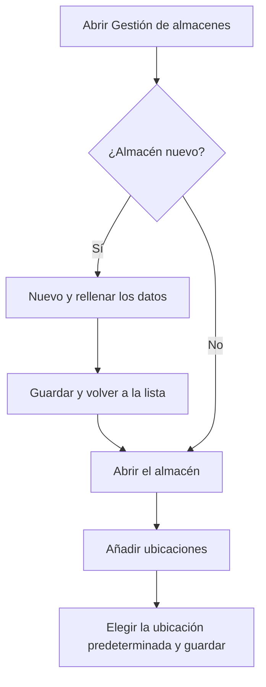

# Gestión de almacenes

## Para qué sirve esta pantalla

Lista los almacenes de la empresa. Cada almacén pertenece a un centro y tiene ubicaciones, que es donde se guarda el stock de cada referencia. Desde aquí se crea un almacén nuevo, se abre un almacén para configurar sus ubicaciones y su ubicación predeterminada, o se elimina uno. El stock guardado en estos almacenes se consulta en «Existencias», y su historial en «Movimientos de almacén».

## Acciones disponibles

- Crear un almacén con el botón «Nuevo» (+). Se abre la pantalla «Alta de almacén».
- Abrir un almacén haciendo clic en su fila para editar sus datos y sus ubicaciones.
- Eliminar un almacén con la papelera de la fila («Eliminar») y confirmar el mensaje «¿Seguro que quieres eliminar el almacén...?».
- Consultar el «Nombre», la «Descripción» y si está «Desactivado».

## Flujo habitual

1. Pulsa «Nuevo» (+) para dar de alta un almacén.
2. Rellena el «Nombre», la «Descripción» y el «Centro» y pulsa «Guardar».
3. Vuelve a la lista y abre el almacén que acabas de crear.
4. Añade sus ubicaciones en la tabla «Ubicaciones».
5. Elige la «Ubicación predeterminada» y pulsa «Guardar».

## Aspectos importantes

- La «Ubicación predeterminada» es donde el sistema deja las entradas y salidas automáticas cuando no se indica otra ubicación: recepciones de compra, albaranes de venta, producción de las órdenes de fabricación y recortes que vuelven de las máquinas. El sistema la toma de un almacén activo (no desactivado).
- Un almacén desactivado se sigue viendo en esta lista, pero su stock deja de aparecer en «Existencias» y en «Inventario» y sus ubicaciones no aparecen en los desplegables de ubicación.
- Al crear una máquina, el sistema crea automáticamente una ubicación de tipo «Suministro» llamada «APR-» más el nombre de la máquina en un almacén activo. Es donde va el material que se aprovisiona a la máquina.
- La eliminación es definitiva y también elimina las ubicaciones del almacén. No se puede eliminar un almacén si alguna ubicación tiene stock o movimientos de almacén; en ese caso, márcalo como «Desactivado».

## Errores frecuentes

- Si aparece «No se ha podido eliminar el almacén ...», alguna ubicación tiene stock o movimientos: márcalo como «Desactivado».
- Si una recepción, un albarán o el final de una orden de fabricación falla con «No hay una ubicación por defecto definida en el proyecto», abre el almacén activo y elige su «Ubicación predeterminada».
- Si después de crear un almacén no aparece el mensaje «Almacén creado correctamente», comprueba primero que no exista otro con el mismo nombre.
- Si el stock de un almacén ha desaparecido de «Existencias», comprueba que el almacén o la ubicación no estén marcados como «Desactivado».

## Proceso básico

